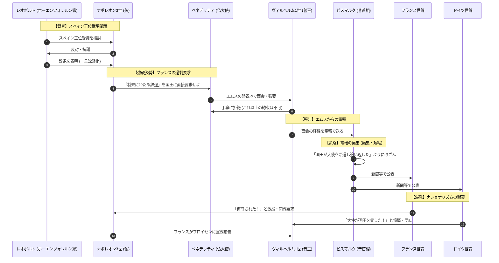

```mermaid
sequenceDiagram
    autonumber
    participant L as レオポルト (ホーエンツォレルン家)
    participant N as ナポレオン3世 (仏)
    participant BND as ベネデッティ (仏大使)
    participant V as ヴィルヘルム1世 (普王)
    participant B as ビスマルク (普首相)
    participant FR as フランス世論
    participant GER as ドイツ世論

    Note over L, N: 【背景】スペイン王位継承問題
    L->>N: スペイン王位受諾を検討
    N->>L: 反対・抗議
    L->>N: 辞退を表明 (一旦沈静化)

    Note over N, BND: 【強硬姿勢】フランスの過剰要求
    N->>BND: 「将来にわたる辞退」を国王に直接要求せよ
    BND->>V: エムスの静養地で面会・強要
    V->>BND: 丁寧に拒絶 (これ以上の約束は不可)
    
    Note over V, B: 【報告】エムスからの電報
    V->>B: 面会の経緯を電報で送る
    
    Note over B: 【策略】電報の編集 (編集・短縮)
    B->>B: 「国王が大使を冷遇し追い返した」ように改ざん
    B->>FR: 新聞等で公表
    B->>GER: 新聞等で公表

    Note over FR, GER: 【爆発】ナショナリズムの衝突
    FR->>N: 「侮辱された！」と激昂・開戦要求
    GER->>V: 「大使が国王を脅した！」と憤慨・団結
    
    N->>V: フランスがプロイセンに宣戦布告
```
