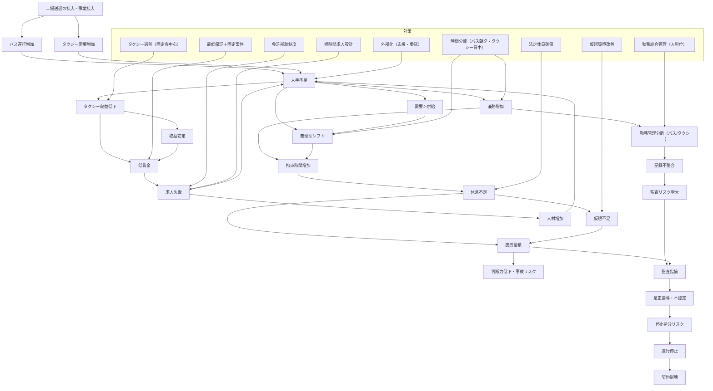

```mermaid
flowchart TB

%% =========================
%% 起点：需要増
%% =========================

A[工場送迎の拡大・事業拡大]

%% =========================
%% 人手不足構造
%% =========================

A --> B[バス運行増加]
A --> C[タクシー需要増加]

B --> D[人手不足]
C --> D

D --> E[兼務増加]
D --> F[無理なシフト]

%% =========================
%% 労務・疲労問題
%% =========================

E --> G[拘束時間増加]
F --> G

G --> H[休息不足]
H --> I[疲労蓄積]

I --> J[判断力低下・事故リスク]

%% =========================
%% 管理崩壊
%% =========================

E --> K[勤務管理分断（バス/タクシー）]
K --> L[記録不整合]

L --> M[監査リスク増大]

%% =========================
%% 仮眠・環境問題
%% =========================

H --> N[仮眠不足]
N --> I

%% =========================
%% 監査・認定
%% =========================

M --> O[監査指摘]
I --> O

O --> P[是正指導・不認定]
P --> Q[停止処分リスク]

Q --> R[運行停止]
R --> S[契約崩壊]

%% =========================
%% タクシー問題
%% =========================

D --> T[タクシー収益低下]
T --> U[低賃金]
U --> V[求人失敗]

V --> D

%% =========================
%% 根本構造（悪循環）
%% =========================

D --> W[需要＞供給]
W --> F

%% =========================
%% 対策群
%% =========================

subgraph 対策

X1[時間分離（バス朝夕・タクシー日中）]
X2[勤務統合管理（人単位）]
X3[法定休日確保]
X4[仮眠環境改善]
X5[タクシー選別（固定客中心）]
X6[外部化（応援・委託）]
X7[最低保証＋固定案件]
X8[免許補助制度]
X9[短時間求人設計]

end

%% =========================
%% 対策の効果
%% =========================

X1 --> E
X1 --> F

X2 --> K
X3 --> H

X4 --> N

X5 --> T
X6 --> D

X7 --> U
X8 --> V
X9 --> V

%% =========================
%% 良循環
%% =========================

V --> AA[人材増加]
AA --> D

T --> AB[収益安定]
AB --> U
```
