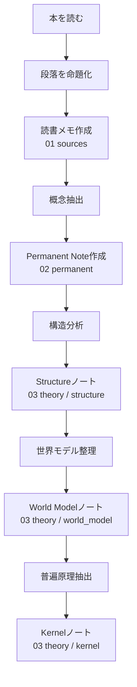

# 手順
## ステップ1
本や文章を読む
目的
- 文章を知識に変換する材料を取る
やること
- 段落ごとに読む
- 重要部分を抽出
## ステップ2
段落 → 命題化
段落
- 国家は単なる暴力装置ではなく、支配の正統性を必要とする。
命題
- 国家は正統性を必要とする
ルール
- 1段落 = 1命題
## ステップ3
読書メモを作成する。
保存場所
01 sources
例
- [主張] 国家は正統性を必要とする
- [分類] 正統性には伝統・カリスマ・合法性がある
- [因果] 合法的支配は官僚制を生む
- [効果] 官僚制は行政効率を高める
ここは原材料と言える。
## ステップ4
命題から概念を抽出する。
例
命題
- 合法的支配は官僚制を生む
概念
- 合法的支配
- 官僚制
## ステップ5
Permanent Note
保存場所

02 permanent
  └ 正統性.md

# 正統性
支配が受け入れられる理由

分類
- 伝統
- カリスマ
- 合法
ここは自分の知識から取り出す。
## ステップ6
Structure分析で関係パターンを抽出する。
例
合法的支配 → 官僚制
これは制度化 → 官僚化という構造。
保存
03 theory / structure

例
制度化 → 官僚化構造.md
## ステップ7
World Modelで社会の構造に統合する。
例
国家
└ 正統性
└ 官僚制
└ 国家能力

保存
03 theory / world_model 国家.md
## ステップ8
Kernel抽出で最後に普遍原理を抽出する。
### 例
観察
制度化 → 官僚化
Kernel
制度化は官僚制を生む

03 theory / kernelに保存

# 判断方法
| 分類          | 特徴          |
| ----------- | ----------- |
| structure   | 関係パターン、因果関係 |
| world model | 社会や組織の構造    |
| kernel      | 普遍原理        |
| permanent   | 概念          |
| sources     | 情報そのもの      |
|             |             |