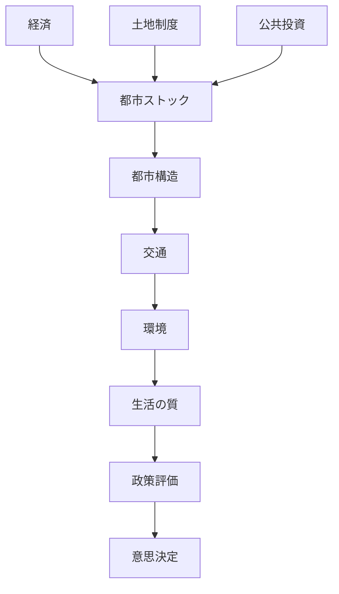
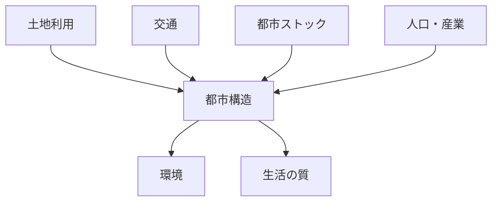

# 空間計画論 Hub

名古屋大学「空間計画論」講義の全体構造。

空間計画とは

都市・国土の空間構造を  
経済・制度・インフラ・環境などの観点から  
統合的に設計する政策分野である。

---

# 全体構造

---

# 講義構造

## 1 空間計画の基礎

- [[空間計画論 第1回]]
- [[空間計画論 第2回]]
- [[空間計画論 第3回]]

テーマ

- 空間計画とは何か
- 都市成長・衰退
- 都市のダイナミクス

---

## 2 空間経済学

- [[空間計画論 第4回]]

テーマ

- 土地経済
- 都市経済
- 地代理論

---

## 3 ストック経済

- [[空間計画論 第5回]]
- [[空間計画論 第6回]]

テーマ

- 都市ストック
- フローとストック
- インフラ資産

---

## 4 土地制度

- [[空間計画論 第7回]]

テーマ

- 土地制度
- 地価
- 土地市場

---

## 5 環境問題

- [[空間計画論 第8回]]

テーマ

- 都市構造と環境
- コンパクトシティ

---

## 6 空間計画制度

- [[空間計画論 第9回]]

テーマ

- 国土計画
- 都市計画制度

---

## 7 都市政策

- [[空間計画論 第10回]]

テーマ

- 日本の都市問題
- スプロール
- 都市集約

---

## 8 政策評価

- [[空間計画論 第11回]]
- [[空間計画論 第12回]]

テーマ

- 費用便益分析
- 意思決定

---

## 9 持続可能交通

- [[空間計画論 第13回]]

テーマ

- EST
- 持続可能交通

---

## 10 総括

- [[空間計画論 第14回]]

テーマ

- 持続可能都市
- 空間計画の将来

---

# 空間計画の核心モデル

都市問題は次の構造で理解できる。

---

# 空間計画の基本課題

- 都市スプロール
- 自動車依存
- インフラ老朽化
- 人口減少
- 環境問題

---

# キーワード

- コンパクトシティ
- 都市ストック
- 公共投資
- 土地制度
- 持続可能交通
- 政策評価

---

# 自分のメモ

（ここに講義のまとめを書く）