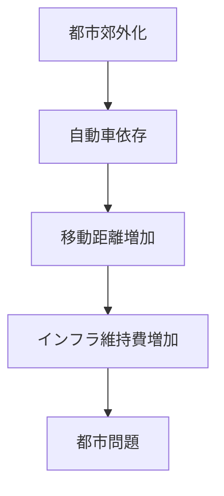
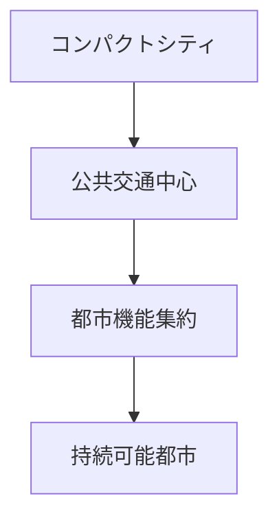

# 概要

日本の都市計画制度には

- 土地所有権の強さ
- 計画規制の弱さ
- 郊外化

などの問題がある。

そのため

- スプロール
- 自動車依存
- インフラ維持コスト増加

といった都市問題が発生している。

今後の都市計画では

- コンパクトシティ
- 公共交通中心都市
- 都市ストック管理

などの政策が重要になる。

---

# 主要命題

## 命題1  
日本の都市計画は規制が弱い。

欧州では

都市計画  
↓  
土地利用決定  

という構造が一般的である。

一方日本では

土地所有  
↓  
開発  

という構造になりやすい。

そのため都市計画の実効性が弱い。

---

## 命題2  
都市のスプロールが進んでいる。

都市が郊外に拡大すると

- 移動距離増加
- 自動車依存
- インフラコスト増加

が発生する。

---

## 命題3  
人口減少社会では都市拡大モデルが成立しない。

これまでの都市計画は

人口増加  
都市拡大  

を前提としていた。

しかし現在は

人口減少  
高齢化  

のため

都市縮小を前提とした計画が必要になる。

---

## 命題4  
コンパクトシティが重要になる。

都市機能を集中させることで

- 公共交通維持
- インフラ効率化
- 環境負荷削減

が可能になる。

---

## 命題5  
都市計画はストック管理政策へ転換する。

これからの都市政策は

都市拡大ではなく

既存都市ストックの

- 維持
- 更新
- 再配置

を中心に考える必要がある。

---

# 日本の都市問題の構造

---

# 都市計画改革の方向

---

# 空間計画への意味

日本の都市計画は

- 制度改革
- 都市構造転換

が必要である。

今後の都市政策では

- コンパクトシティ
- 公共交通政策
- ストック管理

を統合した空間計画が重要になる。

---

# 重要概念

## スプロール

都市が無秩序に郊外へ拡大する現象。

---

## コンパクトシティ

都市機能を集中させ

- 公共交通
- 高密度都市

を実現する都市構造。

---

# 自分のメモ

・日本の都市計画は規制が弱い  
・スプロールが都市問題の原因  
・人口減少社会では都市集約が必要