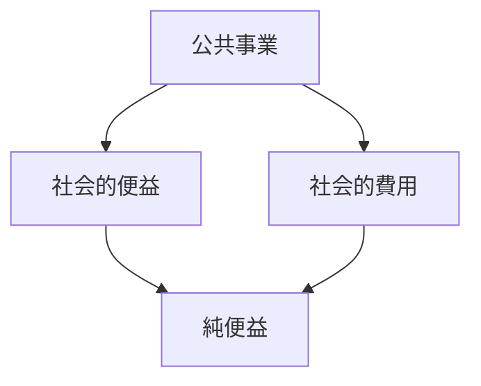

# 概要

空間計画では

- 道路
- 鉄道
- 都市再開発

などの公共投資を評価する必要がある。

その際に用いられる基本手法が  
**費用便益分析（Cost-Benefit Analysis）**である。

---

# 主要命題

## 命題1  
公共投資は社会的費用と社会的便益で評価する。

公共事業では

社会的便益  
−  
社会的費用

を比較する。

---

## 命題2  
便益には様々な種類がある。

代表例

- 移動時間短縮
- 交通事故減少
- 環境改善
- 経済効果

---

## 命題3  
費用には建設費と維持費が含まれる。

費用例

- 建設費
- 維持管理費
- 環境負荷

---

## 命題4  
インフラ評価は長期視点で行う。

インフラは

30〜100年  

利用される。

そのため

長期の費用  
長期の便益  

を評価する必要がある。

---

# 費用便益分析の構造

---

# 重要概念

## 費用便益分析

公共事業の

社会的便益  
社会的費用  

を比較する評価手法。

---

# 自分のメモ

・公共投資は社会的視点で評価する  
・費用便益分析が基本ツール