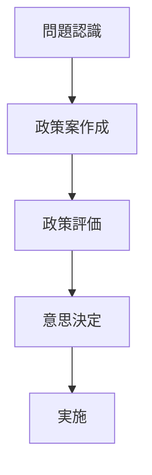

# 概要

空間計画では

- 経済
- 環境
- 社会

など複数の価値を考慮して政策を決定する必要がある。

そのため

単純な経済評価だけでなく  
総合的な意思決定が必要になる。

---

# 主要命題

## 命題1  
空間計画は多目的意思決定である。

都市計画では

- 経済効率
- 環境保全
- 社会公平

など複数の目標が存在する。

---

## 命題2  
政策決定には多主体が関与する。

関係主体

- 国
- 地方自治体
- 民間企業
- 住民

そのため合意形成が重要になる。

---

## 命題3  
計画は政策プロセスとして進む。

計画は

問題認識  
↓  
政策案  
↓  
評価  
↓  
意思決定  
↓  
実施  

というプロセスで進む。

---

# 政策決定プロセス

---

# 空間計画への意味

空間計画は

単なる設計ではなく

**公共政策の意思決定プロセス**

である。

---

# 自分のメモ

・空間計画は多目的意思決定  
・合意形成が重要