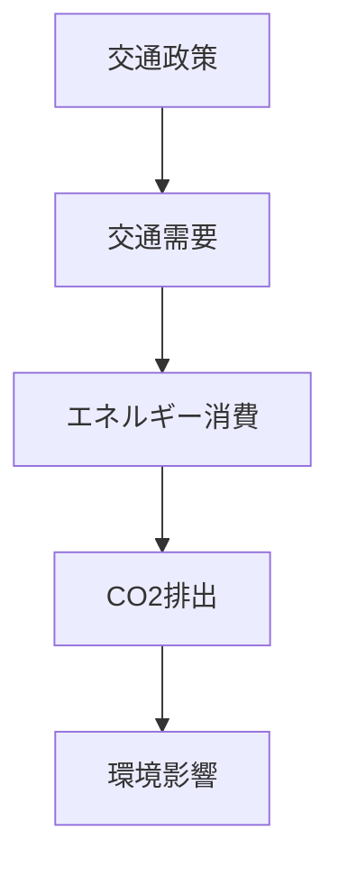

# 概要

交通は

- CO₂排出
- エネルギー消費
- 都市環境

に大きな影響を与える。

そのため持続可能な交通システム

**EST（Environmentally Sustainable Transport）**

の構築が重要である。

ESTは

環境負荷を抑えながら  
都市の移動需要を満たす交通システム

を目指す。

---

# 主要命題

## 命題1  
交通は都市の環境負荷の主要原因である。

都市活動における

CO₂排出の多くは

- 自動車交通
- 物流

など交通部門から発生する。

---

## 命題2  
自動車中心交通は持続可能ではない。

自動車依存型社会では

- CO₂排出増加
- エネルギー消費増大
- 都市渋滞

が発生する。

---

## 命題3  
ESTは交通政策の新しい枠組みである。

ESTの目標

- 環境負荷低減
- 持続可能交通
- 都市生活の質向上

---

## 命題4  
ESTには技術政策と交通政策の両方が必要である。

### 技術政策

- 低燃費車
- 電気自動車
- 燃料改善

### 交通政策

- 公共交通利用促進
- 都市構造改善
- 交通需要管理

---

## 命題5  
交通政策は都市構造と連動する。

持続可能交通を実現するには

- コンパクトシティ
- 公共交通中心都市

など都市構造の改善が必要になる。

---

# EST政策の構造

---

# 技術政策と交通政策

---

# 代表的EST施策

- LRT（Light Rail Transit）
- BRT（Bus Rapid Transit）
- モビリティ・マネジメント
- パークアンドライド
- 交通需要管理

---

# 空間計画への意味

持続可能交通は

交通政策だけではなく

- 都市構造
- 土地利用
- 公共交通

を統合した空間計画によって実現される。

---

# 重要概念

## EST（Environmentally Sustainable Transport）

環境負荷を抑えながら  
交通需要を満たす交通システム。

---

## モビリティ・マネジメント

人々の交通行動を

- 公共交通
- 徒歩
- 自転車

へ転換する政策。

---

# 自分のメモ

・交通政策は環境政策でもある  
・技術だけではCO₂削減は不十分  
・都市構造と交通政策を統合する必要