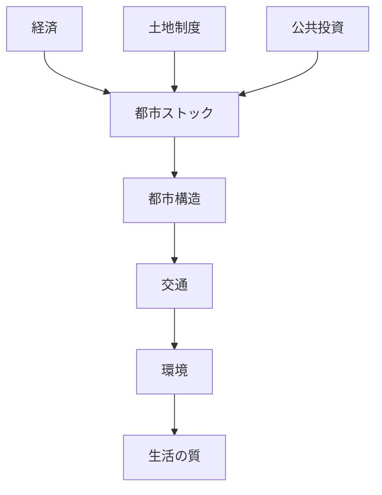

# 概要

この講義では

- 経済
- 土地制度
- 公共投資
- 都市ストック
- 環境
- 交通

などの視点から空間計画を学んできた。

最終回ではそれらを統合し

これからの社会に必要な  
**持続可能な空間計画**

について整理する。

---

# 主要命題

## 命題1  
空間計画は多分野統合の学問である。

空間計画では

- 経済
- 環境
- 社会
- 技術
- 制度

などを統合して都市・国土を設計する必要がある。

---

## 命題2  
都市問題は空間構造の問題である。

多くの都市問題

- 渋滞
- 環境問題
- 郊外化
- インフラ維持

は

都市構造  
交通  
土地利用

の関係から生じる。

---

## 命題3  
人口減少社会では都市拡大モデルが崩れる。

これまでの都市計画は

人口増加  
経済成長  

を前提としていた。

しかし現在は

人口減少  
高齢化  

のため

都市縮小を前提とした計画が必要になる。

---

## 命題4  
持続可能都市が重要になる。

今後の都市政策では

- 環境負荷削減
- 公共交通中心都市
- コンパクトシティ

などが重要になる。

---

## 命題5  
空間計画は社会の未来設計である。

空間計画は

単なる都市設計ではなく

社会の将来構造を決める  
**長期政策**

である。

---

# 空間計画の統合モデル

---

# 空間計画の政策領域

主な政策領域

- 都市計画
- 交通政策
- 環境政策
- インフラ政策
- 地域政策

これらを統合して  
空間計画が形成される。

---

# 今後の空間計画の課題

- 人口減少社会への対応
- インフラ老朽化
- 地球環境問題
- 地域格差
- 持続可能都市の実現

---

# 重要概念

## 持続可能都市

環境・社会・経済のバランスを取りながら  
長期的に維持可能な都市。

---

## 空間計画

都市や国土の

- 空間構造
- 土地利用
- 交通

などを統合して設計する政策。

---

# 自分のメモ

・空間計画は都市政策の統合分野  
・人口減少社会では都市構造の再設計が必要  
・都市問題は空間構造から理解する