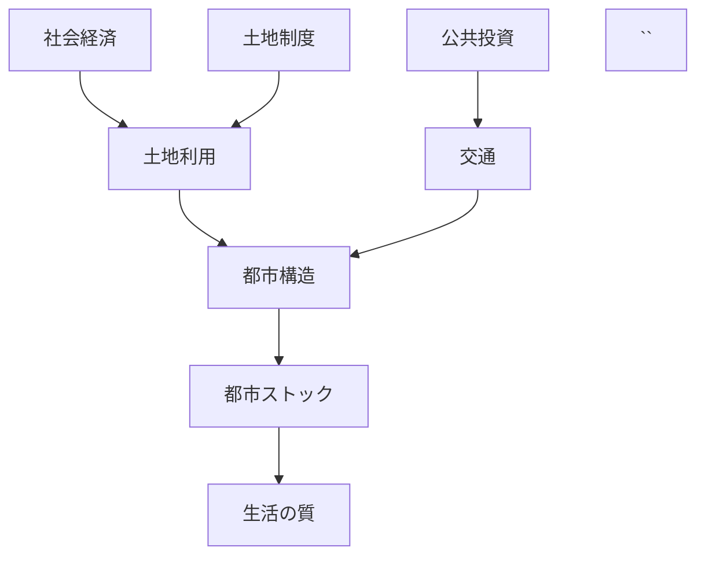

# 概要

空間計画とは、都市や国土の空間構造を長期的視点から設計する政策・計画分野である。  
土地利用、交通、公共投資、環境などの要素が相互作用して都市構造が形成されるため、それらを統合的に分析し計画する必要がある。

---

# 主要命題

## 命題1  
都市は「空間構造」で理解する必要がある。

都市問題は単なる経済問題ではなく、

- 人口分布
- 交通
- 土地利用
- インフラ

が形成する **空間構造**の問題である。

---

## 命題2  
都市は長期ストックによって形成される。

都市は

- 道路
- 鉄道
- 住宅
- 公共施設

などの **都市ストックの蓄積**によって形成される。

これらは数十年〜百年以上残るため、

都市構造は短期では変更できない。

---

## 命題3  
空間構造は公共投資によって大きく決まる。

特に影響が大きいのは

- 道路
- 鉄道
- 港湾
- 空港

などの社会資本整備である。

公共投資は

地域の発展  
都市構造  
交通流

を長期的に決定する。

---

## 命題4  
市場だけでは都市空間は最適にならない。

理由

- 外部性
- 公共財
- 情報の不完全性

例

- 渋滞
- 都市スプロール
- 環境問題

そのため空間計画が必要になる。

---

## 命題5  
日本では土地所有権が強く、都市計画が弱い。

欧州

都市計画  
↓  
土地利用決定

日本

土地所有  
↓  
開発

この違いが

- スプロール
- 無秩序開発

の原因となる。

---

## 命題6  
人口減少社会では都市縮小の計画が必要になる。

これからの課題

- インフラ維持
- 空き家
- 都市縮小

対策

コンパクトシティ  
公共交通中心都市

---

# 構造

# 重要概念
## 空間計画
国土・都市の空間構造を設計する計画分野。
### 対象
- 土地利用
- 交通
- 環境
- 公共施設
## 都市ストック
都市に蓄積された物的資産
### 例
- 道路
- 鉄道
- 住宅 公園
- インフラ
## コンパクトシティ
人口減少社会において、都市機能を集中させ、公共交通中心の都市構造を作る政策。
### 例
鉄道会社主導の都市形成
日本では、
鉄道会社
↓
沿線開発
↓
住宅地形成
という形で都市が拡大した。
### 例
阪急
東急
# 自分のメモ
 - 都市はフローではなくストックで理解する必要がある
 - 公共投資が都市構造を決める
 - 人口減少社会では都市縮小計画が重要