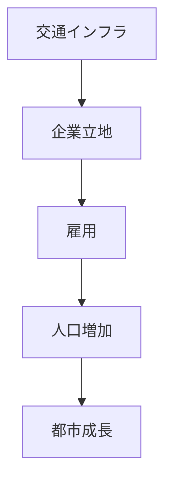
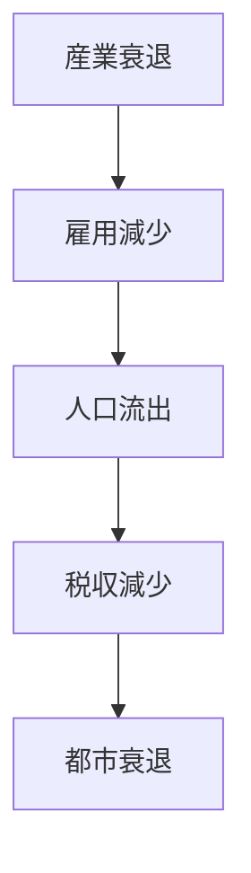

# 概要

この講義では、空間計画を理解するための基本概念として  
都市・国土の成長、衰退、再生のメカニズムが説明される。

都市は固定的な存在ではなく

- 成長
- 停滞
- 衰退
- 再生

というライフサイクルを持つ。

空間計画とは、このダイナミクスを理解し  
都市・地域の将来構造を設計する政策分野である。

---

# 主要命題

## 命題1  
都市・地域は成長と衰退のサイクルを持つ。

都市は常に発展するわけではない。

基本パターン

- 成長
- 成熟
- 衰退
- 再生

これは

- 産業構造
- 人口
- 交通

などの変化によって生じる。

---

## 命題2  
交通インフラは都市成長の重要要因である。

交通の改善は

- 人の移動
- 物流
- 企業立地

を変化させる。

その結果

都市の空間構造が変化する。

---

## 命題3  
産業構造の変化が都市の盛衰を決める。

都市の発展は

- 工業
- 商業
- サービス業

などの産業活動に依存する。

産業が衰退すると

人口減少  
都市衰退  

が発生する。

---

## 命題4  
空間計画は都市再生のために必要である。

都市が衰退した場合、

- インフラ再整備
- 土地利用転換
- 産業誘致

などによって再生を図る必要がある。

---

## 命題5  
人口減少社会では都市の縮小管理が必要になる。

今後の日本では

- 人口減少
- 高齢化

が進む。

そのため

都市拡大ではなく  
都市縮小の計画が重要になる。

---

# 都市成長の構造

---

# 都市衰退の構造

---

# 都市再生の政策

都市再生のための政策例

- 再開発
- インフラ投資
- 産業政策
- 交通改善
- 都市機能集約

---

# 重要概念

## 都市ライフサイクル

都市は

成長  
↓  
成熟  
↓  
衰退  
↓  
再生

というサイクルを持つ。

---

## 都市再生

衰退した都市を

- 経済
- インフラ
- 空間構造

の再設計によって再活性化する政策。

---

# 自分のメモ

・都市は静的ではなく動的システム  
・交通と産業が都市成長の鍵  
・人口減少社会では都市縮小が重要