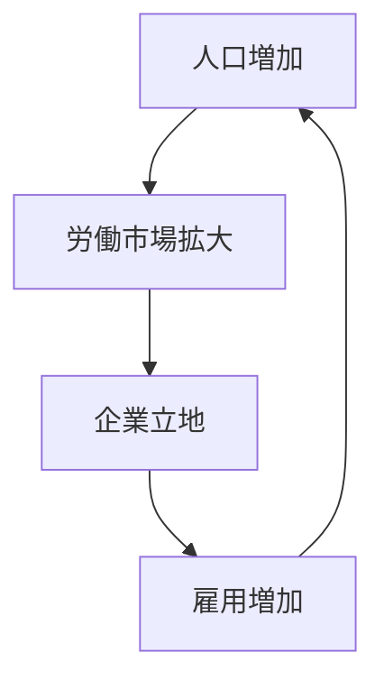
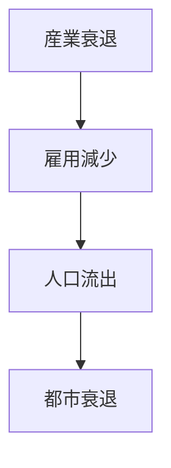
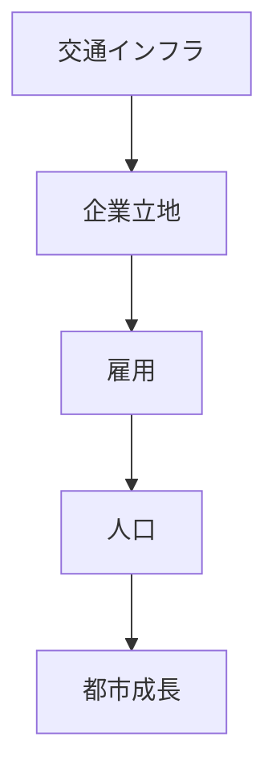
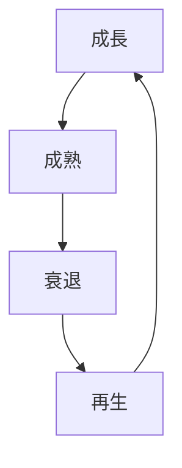

# 概要

この講義では、都市や国家がどのように

- 成長
- 停滞
- 衰退
- 再生

するのかというメカニズムを説明する。

都市の盛衰は偶然ではなく、

- 交通
- 産業
- 人口
- 投資

などの要因の相互作用によって生じる。

空間計画とは、このメカニズムを理解した上で  
都市や地域の将来構造を設計する政策である。

---

# 主要命題

## 命題1  
都市成長は「集積」によって生まれる。

企業や人口が集中すると

- 知識共有
- 労働市場拡大
- 物流効率化

が生じる。

これを **集積の経済 (Agglomeration Economy)** という。

---

## 命題2  
交通は都市成長の基盤である。

交通インフラは

- 人の移動
- 物流
- 市場アクセス

を改善する。

その結果

企業立地  
人口集中  

が起こる。

---

## 命題3  
都市の成長は自己強化的である。

都市成長の基本ループ

この正のフィードバックによって  
都市は急速に成長する。

---

## 命題4  
都市衰退は逆のフィードバックで起こる。

産業衰退が起こると

- 雇用減少
- 人口流出
- 投資減少

が起きる。

---

## 命題5  
都市再生には新しい成長エンジンが必要である。

衰退した都市を再生するには

- 新産業
- 交通投資
- 都市再開発
- 教育研究拠点

などの導入が必要になる。

---

# 都市発展の基本構造

都市発展は次のような構造で説明できる。

---

# 国・都市のライフサイクル

都市は次の段階を経る。

1 成長  
2 成熟  
3 衰退  
4 再生

---

# 空間計画の役割

空間計画は

都市成長の促進  
都市衰退の防止  
都市再生の支援  

を目的とする。

主な政策手段

- 交通インフラ
- 土地利用計画
- 都市再開発
- 産業政策

---

# 重要概念

## 集積の経済

企業や人口が集中することで

- 生産性向上
- 知識共有
- 市場拡大

が起こる現象。

---

## 都市ライフサイクル

都市は

成長  
成熟  
衰退  
再生  

という循環を持つ。

---

# 自分のメモ

・都市成長の本質は集積の経済  
・交通インフラは都市成長の基盤  
・都市衰退は負のフィードバックで進む