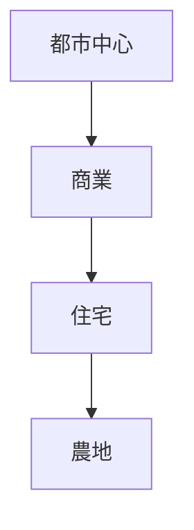
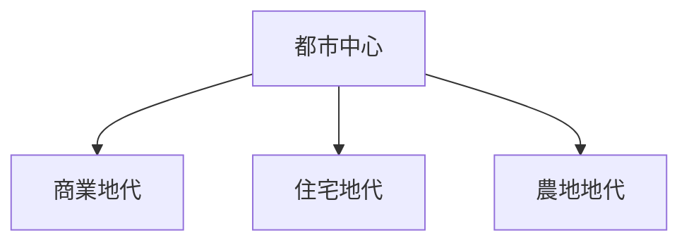

# 概要

空間計画を理解するためには、都市や土地利用を説明する  
「空間経済学」の基本理論を理解する必要がある。

都市の土地利用は

- 交通費
- 地価
- 立地競争

などの経済要因によって決まる。

この講義では

- 地代理論
- 土地利用競争
- 都市構造

などの基礎理論を学ぶ。

---

# 主要命題

## 命題1  
土地利用は市場競争によって決まる。

都市では

- 商業
- 住宅
- 工業

などの土地利用が競争する。

最も高い地代を払える用途が  
その土地を利用する。

---

## 命題2  
都市中心に近いほど地価は高い。

理由

- 交通費が低い
- 市場アクセスが良い

ためである。

都市中心から距離が遠くなるほど  
地価は低下する。

---

## 命題3  
都市構造は交通費によって決まる。

交通費が高い場合

都市は

- 高密度
- 集中型

になる。

交通費が低い場合

都市は

- 郊外化
- スプロール

が進む。

---

## 命題4  
土地利用は「地代曲線」によって説明できる。

企業や住民は

立地によって得られる利益から  
地代を支払う。

この地代の最大値を示す曲線が  
**地代曲線（Bid Rent Curve）**である。

都市中心に近いほど  
支払可能地代は高くなる。 2

---

## 命題5  
都市は経済合理性によって空間構造が形成される。

都市の構造は

- 地価
- 交通費
- 利益

のバランスによって決まる。

つまり都市構造は  
経済行動の結果として生まれる。

---

# 都市構造の基本モデル

都市中心では  
地価が高いため

- 商業
- オフィス

が立地する。

郊外では

- 住宅
- 農地

が多くなる。

---

# 地代曲線モデル

都市中心では

商業 > 住宅 > 農地  

の順に支払可能地代が高い。

---

# 空間計画への意味

空間計画では

- 地価
- 交通
- 土地利用

の関係を理解する必要がある。

これを無視すると

- スプロール
- 渋滞
- 都市問題

が発生する。

---

# 重要概念

## 地代理論

土地利用は  
支払可能な地代の競争によって決まる。

---

## 都市経済学

都市の

- 立地
- 交通
- 土地利用

を経済学で説明する分野。

---

# 自分のメモ

・都市構造は経済行動の結果  
・交通費が都市構造を決める  
・地代競争が土地利用を決定する