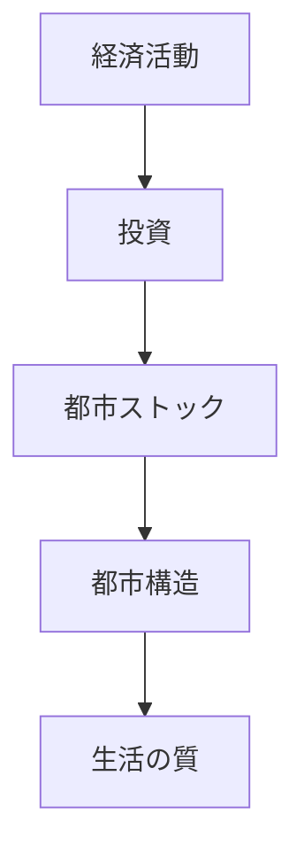
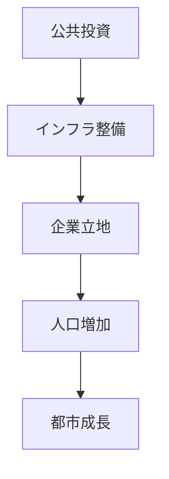

# 概要

空間計画では都市を

- フロー（短期的活動）
- ストック（蓄積された資産）

に分けて理解する必要がある。

都市や国土の構造は

- 道路
- 鉄道
- 住宅
- 公共施設

などの **ストックの蓄積**によって形成される。

ストックは長期間にわたり社会に影響を与えるため、  
公共投資や都市計画は長期視点で考える必要がある。

---

# 主要命題

## 命題1  
都市はストックによって形成される。

都市を構成する主なストック

- 住宅
- インフラ
- 建物
- 公共施設
- 土地利用

これらの蓄積が都市構造を作る。

---

## 命題2  
ストックは長期間残る。

インフラや都市構造は

数十年〜100年以上  
残る場合が多い。

そのため

一度作った都市構造は  
簡単には変更できない。

---

## 命題3  
ストック形成には大規模投資が必要である。

ストック形成の例

- 道路建設
- 鉄道整備
- 港湾整備
- 住宅開発

これらは多額の資金と長期時間を必要とする。

---

## 命題4  
ストックは維持管理が必要である。

都市ストックは

- 老朽化
- 劣化

するため

- 更新
- 修繕
- 再投資

が必要になる。

---

## 命題5  
人口減少社会ではストック過剰が問題になる。

人口減少により

- 空き家
- インフラ過剰
- 都市維持コスト増大

が発生する。

そのため

都市縮小  
コンパクトシティ  

などの政策が重要になる。

---

# フローとストックの関係

---

# ストック形成のプロセス

---

# 空間計画への意味

ストックの視点から見ると  
空間計画は

短期政策ではなく

**長期的な都市構造形成政策**

である。

重要な政策分野

- インフラ整備
- 土地利用計画
- 都市再開発
- 都市縮小政策

---

# 重要概念

## ストック

長期間にわたり社会に蓄積される資産。

例

- インフラ
- 建物
- 都市施設

---

## フロー

一定期間内に発生する経済活動。

例

- 生産
- 消費
- 投資

---

# 自分のメモ

・都市はフローではなくストックで理解する  
・公共投資は都市構造を決定する  
・人口減少社会ではストック管理が重要