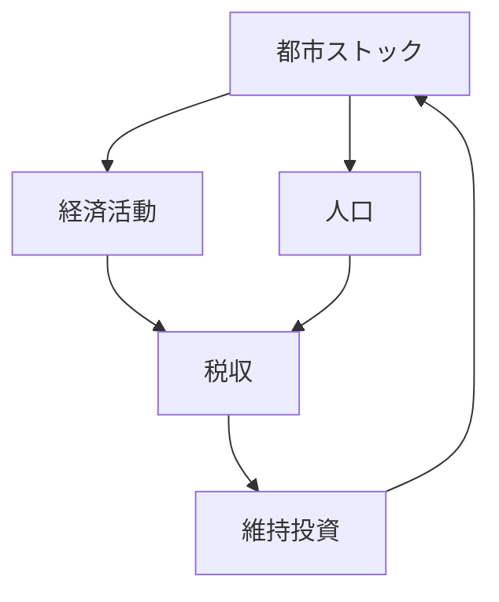

# 概要

都市や国土の構造は

- ストック（蓄積された資産）
- フロー（経済活動）

の相互作用によって形成される。

空間計画では

- ストックの形成
- ストックの維持
- ストックの更新

を長期的に管理する必要がある。

特に人口減少社会では  
既存ストックの維持・更新が大きな政策課題となる。

---

# 主要命題

## 命題1  
都市はストックとフローの相互作用で成立する。

都市では

- 住宅
- インフラ
- 建物

などのストックが存在し、

そこに

- 経済活動
- 人口移動
- 企業活動

などのフローが生じる。

---

## 命題2  
フローはストックによって制約される。

例

- 道路 → 交通量
- 住宅 → 人口
- 工場 → 生産

つまり

ストックがフローの上限を決める。

---

## 命題3  
ストックはフローによって維持される。

都市ストックは

- 税収
- 投資
- 利用者

によって維持される。

フローが減少すると

インフラ維持が困難になる。

---

## 命題4  
人口減少はストック管理問題を生む。

人口減少により

- 利用者減少
- 税収減少
- インフラ過剰

が発生する。

これにより

都市の維持コストが増加する。

---

## 命題5  
空間計画ではストック更新戦略が重要になる。

今後の都市政策では

- インフラ更新
- 都市集約
- 公共交通維持

などのストック管理が重要になる。

---

# ストックとフローの関係

---

# ストック維持の問題

都市ストックは

- 老朽化
- 劣化

するため

- 修繕
- 更新
- 再投資

が必要になる。

しかし人口減少により

維持費 > 利用価値  

となるケースが増える。

---

# 空間計画への意味

空間計画は

都市拡大政策ではなく

**都市資産管理政策**

としての性格が強くなる。

重要な政策

- インフラ更新
- 都市集約
- 公共交通維持
- 空き家対策

---

# 重要概念

## ストック

長期間社会に蓄積される資産

例

- 道路
- 鉄道
- 建物
- 公共施設

---

## フロー

一定期間内に発生する活動

例

- 生産
- 消費
- 投資
- 人口移動

---

# 自分のメモ

・ストックはフローを制約する  
・フローはストックを維持する  
・人口減少社会ではストック管理が中心課題