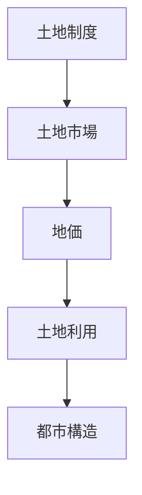

# 概要

都市や国土の空間構造は

- 土地所有制度
- 地価
- 開発制度

などの **土地制度（Land System）**によって大きく影響される。

空間計画では

土地制度  
土地市場  
土地政策  

を理解することが重要になる。

特に日本では  
土地所有権が強いことが  
都市構造に大きな影響を与えている。

---

# 主要命題

## 命題1  
都市構造は土地制度によって強く制約される。

都市の空間構造は

- 土地所有権
- 開発規制
- 税制度

などによって決まる。

つまり

土地制度  
→ 土地利用  
→ 都市構造

という関係がある。

---

## 命題2  
土地市場では地価が土地利用を決定する。

都市では

- 商業
- 住宅
- 工業

などの用途が土地を競争する。

最も高い地価を支払える用途が  
土地を利用する。

---

## 命題3  
土地は供給が固定された資源である。

土地は

- 増やすことができない
- 移動できない

という特徴を持つ。

そのため

土地市場は  
一般の財市場と性質が異なる。

---

## 命題4  
土地制度は都市開発の効率に影響する。

適切な土地制度がない場合

- 無秩序開発
- スプロール
- 土地利用の非効率

が発生する。

---

## 命題5  
日本では土地所有権が強い。

欧州では

都市計画  
↓  
土地利用

という構造が多い。

一方日本では

土地所有  
↓  
開発

という構造になりやすい。

この違いが

- スプロール
- 都市計画の弱さ

の原因となる。

---

# 土地制度と都市構造

---

# 土地市場の特徴

土地は次の特徴を持つ

- 供給が固定
- 移動できない
- 位置価値が重要

そのため

地価  
立地  

が重要になる。

---

# 空間計画への意味

土地制度を理解しないと

- 都市計画
- インフラ整備
- 都市再開発

はうまく機能しない。

空間計画では

土地制度  
土地政策  

を含めて考える必要がある。

---

# 重要概念

## 土地制度

土地の

- 所有
- 利用
- 取引

を規定する制度。

---

## 土地市場

土地が

売買  
賃貸  

される市場。

---

# 自分のメモ

・都市構造は土地制度に大きく依存する  
・土地は供給が固定された資源  
・土地制度は空間計画の重要な前提条件