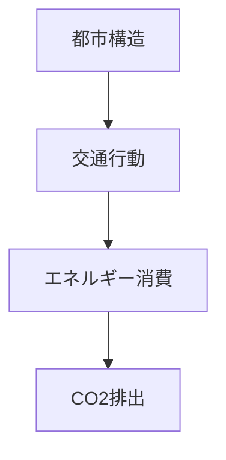
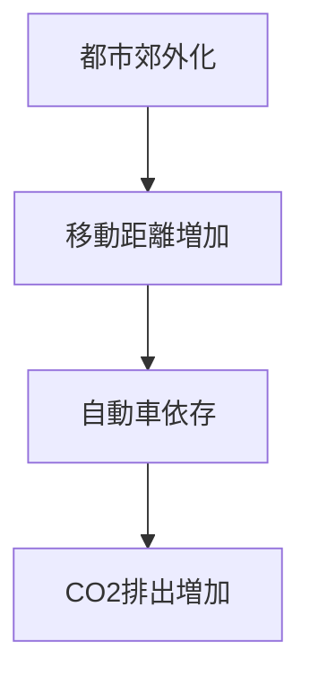
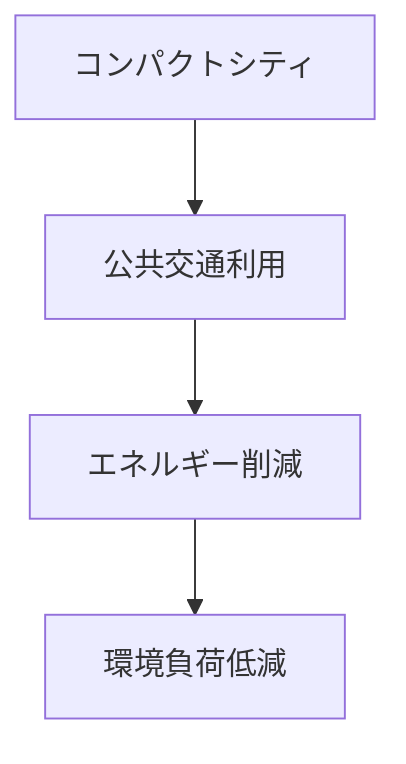

# 概要

都市の空間構造は

- 交通
- 土地利用
- エネルギー消費

に大きな影響を与える。

そのため空間計画は  
環境問題の重要な要因となる。

特に

- CO₂排出
- エネルギー消費
- 大気汚染

などは都市構造と強く関係する。

---

# 主要命題

## 命題1  
都市構造は環境負荷を決定する。

都市の

- 密度
- 交通手段
- 土地利用

によって

エネルギー消費  
CO₂排出  

が大きく変化する。

---

## 命題2  
自動車依存型都市は環境負荷が大きい。

都市が郊外化すると

- 移動距離増加
- 自動車依存

が起こる。

結果として

CO₂排出  
エネルギー消費  

が増加する。

---

## 命題3  
公共交通中心の都市は環境負荷が小さい。

都市が

- 高密度
- 公共交通中心

の場合

自動車利用が減少する。

結果

エネルギー消費  
CO₂排出  

が減少する。

---

## 命題4  
コンパクトシティは環境政策でもある。

都市機能を集中させることで

- 移動距離短縮
- 公共交通利用促進
- エネルギー効率向上

が実現する。

---

## 命題5  
空間計画は環境政策の重要な手段である。

環境問題の対策は

技術だけではなく

都市構造  
交通システム  

の改善によって行う必要がある。

---

# 都市構造と環境負荷

---

# 郊外化の構造

---

# 持続可能な都市構造

---

# 空間計画への意味

環境問題を解決するためには

技術政策だけでなく

- 都市構造
- 交通システム
- 土地利用

を統合的に設計する必要がある。

つまり

空間計画 = 環境政策

でもある。

---

# 重要概念

## コンパクトシティ

都市機能を集中させ

- 移動距離短縮
- 公共交通利用

を促進する都市構造。

---

## 環境負荷

都市活動によって生じる

- CO₂排出
- エネルギー消費
- 大気汚染

など。

---

# 自分のメモ

・都市構造が環境負荷を決める  
・郊外化はCO₂排出を増加させる  
・コンパクトシティは環境政策でもある