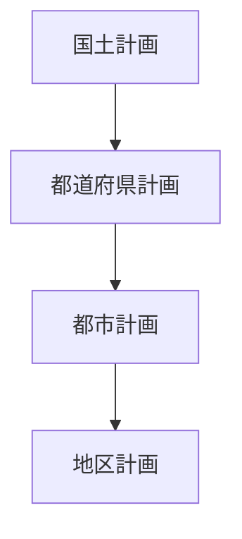
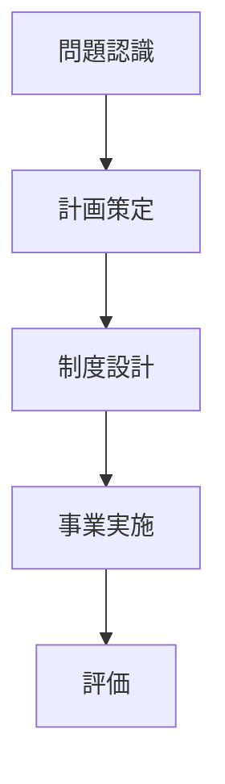

# 概要

空間計画は単なる設計ではなく

制度  
政策  
行政プロセス  

によって実行される。

日本では

- 国土計画
- 都市計画
- 各種インフラ計画

など複数の制度が組み合わさって  
空間計画が実施されている。

---

# 主要命題

## 命題1  
空間計画は制度によって実行される。

計画は

- 法制度
- 行政組織
- 財政

によって実行される。

そのため

制度理解が不可欠である。

---

## 命題2  
日本の空間計画は多層構造を持つ。

空間計画は

- 国
- 都道府県
- 市町村

の複数レベルで行われる。

---

## 命題3  
国土計画は国全体の空間構造を扱う。

代表例

- 国土形成計画
- 全国総合開発計画（旧制度）

目的

- 国土の均衡発展
- 地域格差是正
- インフラ整備

---

## 命題4  
都市計画は都市レベルの空間計画である。

都市計画では

- 土地利用
- 道路
- 公園
- 市街地整備

などを計画する。

---

## 命題5  
空間計画は多くの主体の協力で実施される。

関係主体

- 国
- 地方自治体
- 民間企業
- 住民

そのため

調整プロセスが重要になる。

---

# 日本の空間計画制度

---

# 空間計画の政策プロセス

---

# 空間計画制度の特徴

日本の制度の特徴

- 多層的行政構造
- 法制度中心
- 合意形成重視

---

# 空間計画への意味

空間計画は

設計  
経済  
制度  
政策  

を統合する分野である。

つまり

空間計画 = 公共政策

でもある。

---

# 重要概念

## 国土計画

国家レベルでの

- 国土構造
- インフラ配置

を決める計画。

---

## 都市計画

都市の

- 土地利用
- 交通
- 市街地整備

を計画する制度。

---

# 自分のメモ

・空間計画は制度によって実行される  
・日本では国土計画と都市計画が重要  
・空間計画は政策プロセス