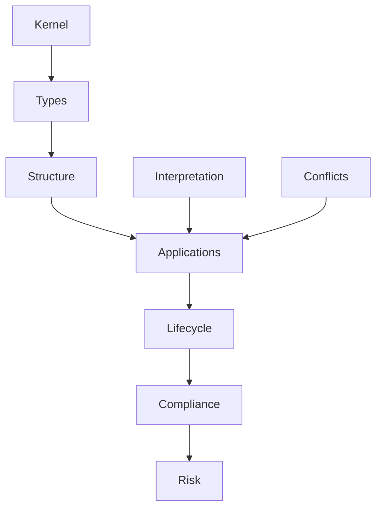

| フォルダ           | 内容   |
| -------------- | ---- |
| Norm Kernel    | 法哲学  |
| Norm Types     | 条文分類 |
| Structure      | 法構造  |
| Interpretation | 解釈   |
| Conflicts      | 法源競合 |
| Applications   | 条文   |
| Lifecycle      | 契約段階 |
| Compliance     | 業務   |
| Risk Model     | 責任   |
