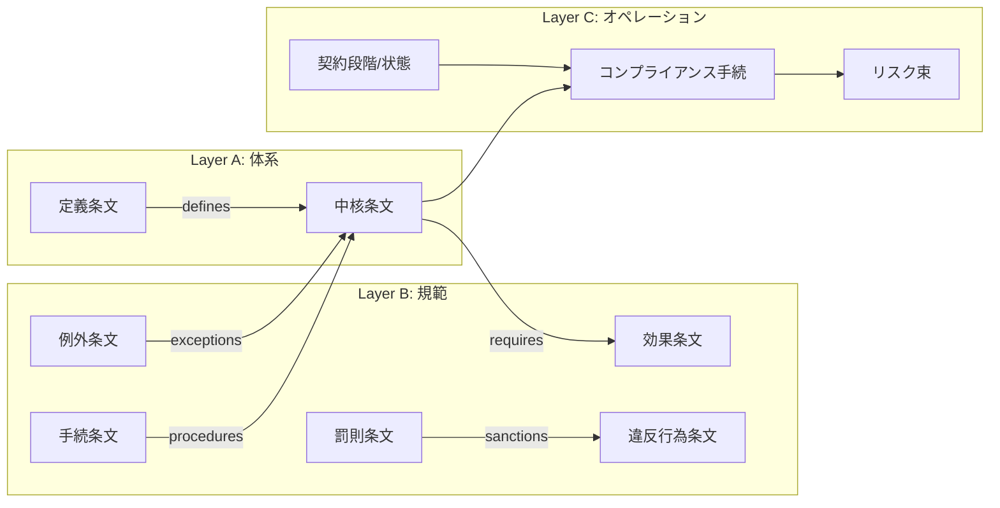
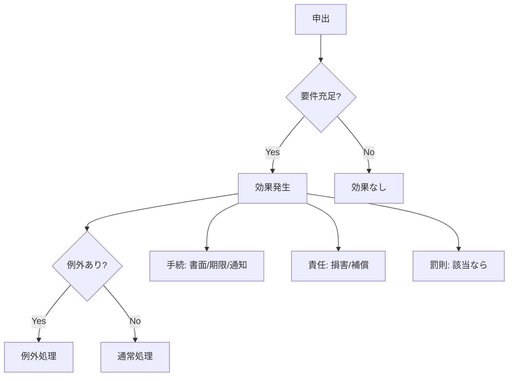
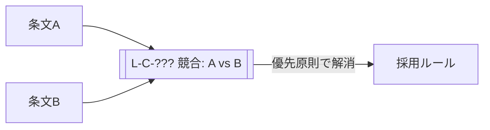

# 概要

条文ネットワーク構造とは、条文を「単体の解説」ではなく、参照・例外・手続・責任・罰則で結ばれた有向グラフとして管理するための構造である。  
狙いは次の3つ。
1. 検索ではなく辿り（Traversal）で答えに到達する
2. 実務フロー（Lifecycle/Compliance）へ接続できる
3. 改正・差分が入ってもネットワークの局所更新で済む
# ノードとエッジの定義（最小公倍の型）

このノートは「ネットワークの型」を固定する。参照の種類の定義自体は [[L-S-004 条文間参照構造]] を一次参照とする。条文ノードは「1条（可能なら1項）」を基本単位とする。
条文ノードが必ず持つメタ
- `law / article / paragraph`
- `norm_type`（[[01_Norm_Types]]へのリンク）    
- `structure`（[[02_Structure]]へのリンク：要件→効果/義務→責任/禁止→罰則/例外）
- `lifecycle`（[[07_Contract_Lifecycle]]へのリンク：どの段階で動くか）
- `compliance`（[[08_Compliance_Architecture]]へのリンク：現場手続へ落とす）
- `risk`（[[06_Risk_Model]]へのリンク）
# 参照タイプ（エッジ種）

ネットワークのエッジ（矢印）は、原則として次を使う。（用語の詳細は [[L-S-004 条文間参照構造]] と整合させる）
- **defines**：定義・用語（定義条文 → 本条）    
- **requires**：成立要件（要件条文 → 効果条文）    
- **exceptions**：例外（例外条文 → 本条）    
- **procedures**：手続（手続条文 → 本条）    
- **sanctions**：罰則（罰則条文 → 違反行為条文）    
- **refers**：明示参照（条文A → 条文B）    
- **conflicts_with**：競合（A ↔ B、優先原則で解消）
# ネットワークを「層」で見る（3レイヤー固定）
条文グラフは混ぜると破綻するので、見方の層を固定する。この3層を切り替えて図示できることが「ネットワークとして使える」条件。
## Layer A: 体系（Concept / Definition）
- 定義、適用範囲、主体分類、用語
## Layer B: 規範（Norm / Obligation）
- 要件→効果、義務→責任、禁止→罰則、例外
## Layer C: オペレーション（Lifecycle / Compliance）
- 契約段階、書面、記録、監査、保存
# Mermaid：ネットワークの基本テンプレ

## 全体俯瞰（法単位のGraph）

各法律ごとに「俯瞰図ノート」を Applications 配下に作り、そこから条文へリンクする。 本ノートではテンプレを定義する。

## 取消・解除の条件分岐（Flowchart）

「条件で結論が変わる」領域は flowchart を標準とする。

# 5. “ネットワーク更新”のルール（運用規約）
条文追加や改正時の更新を局所化するため、ルールを固定する。
## 5-1. 条文を追加したら必ず作るリンク（最低3本）

条文ノートを作ったら、最低でも次を張る：

1. `norm_type`（[[01_Norm_Types]]のどれか）
    
2. `structure`（[[02_Structure]]のどれか）
    
3. `lifecycle` or `compliance`（現場に落ちる導線）
    

## 5-2. 例外は「例外→本則」に向ける
例外条文は「本則のノートへ矢印」を標準にし、逆向きリンクは補助にする。例外は“本則に依存”するから。
## 5-3. 罰則は「罰則→違反行為」へ向ける
[[L-K-007 罰則逆算原則]] と整合。実務では「罰則側から」要件・禁止行為を逆算するほうが速い。
## 5-4. 競合は“競合ノード”を挟む

