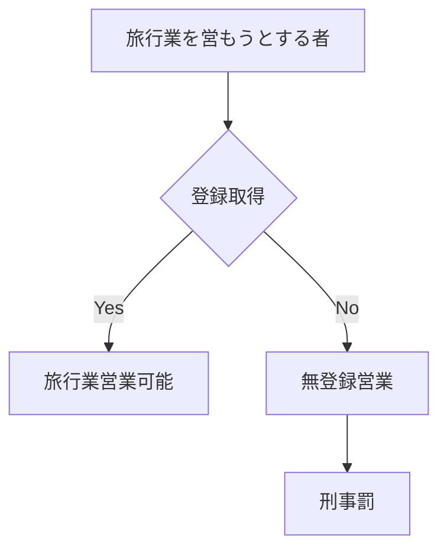

# 旅行業法3条1項

> 旅行業を営もうとする者は、観光庁長官の登録を受けなければならない。

# 構造分解

| 要素 | 内容 |
|---|---|
| 主体 | 旅行業を営もうとする者 |
| 条件 | 旅行業を営む意思 |
| 行為 | 登録を受ける |
| 評価 | 無登録営業の禁止 |
| 手続 | 観光庁長官登録 |

# 解釈
旅行業法の参入規制の根幹条文
旅行業は
- 旅行者から金銭を預かる    
- 他事業者を組み合わせて契約を作る   
という信用依存型ビジネスであるため、自由営業ではなく  登録制（行政監督下）となっている。
実務上は
- 第一種    
- 第二種    
- 第三種    
- 地域限定   
の区分登録が必要。
# 関連条文
- [[TAA-006 旅行業法第6条]]（登録拒否事由）    
- 旅行業法74条（無登録営業の罰則）