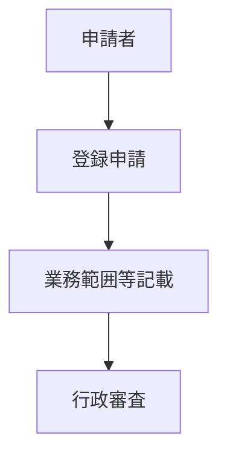

# 旅行業法4条1項
> 登録申請には、業務の範囲その他の事項を記載しなければならない。
# 構造分解

| 要素 | 内容 |
|---|---|
| 主体 | 登録申請者 |
| 条件 | 旅行業登録申請 |
| 行為 | 必要事項記載 |
| 評価 | 登録審査資料 |
| 手続 | 行政提出 |

# 解釈
登録は単なる届け出ではなく、審査制であるため、申請書には
- 業務範囲
- 営業所
- 財産基礎
などを記載する必要がある。
# 関連条文
- [[TAA-006 旅行業法第6条]]（登録拒否事由）