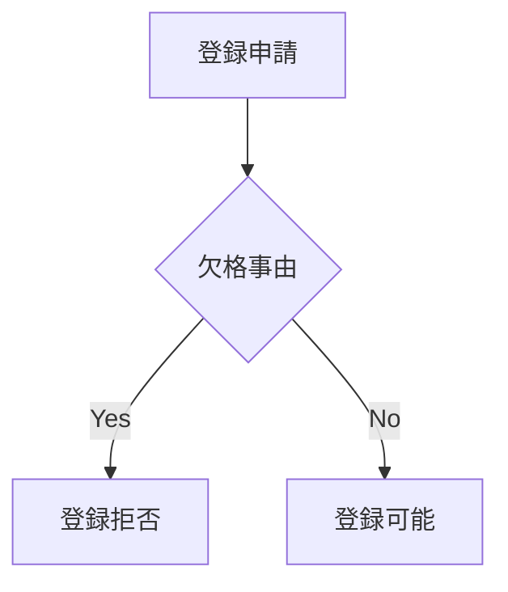

# 旅行業法6条1項

> 次のいずれかに該当する者には登録をしてはならない。

# 構造分解

| 要素 | 内容 |
|---|---|
| 主体 | 行政庁 |
| 条件 | 欠格事由該当 |
| 行為 | 登録拒否 |
| 評価 | 適格性判断 |
| 手続 | 審査 |

# 解釈
旅行業の参入適格性審査条文。
欠格事由は主に
- 刑罰歴
- 財産基礎不足
- 不正行為歴
- など。
旅行者保護の観点から信用の低い事業者を排除する制度である。
# 関連条文
- [[TAA-003 旅行業法第3条]]（登録制度）