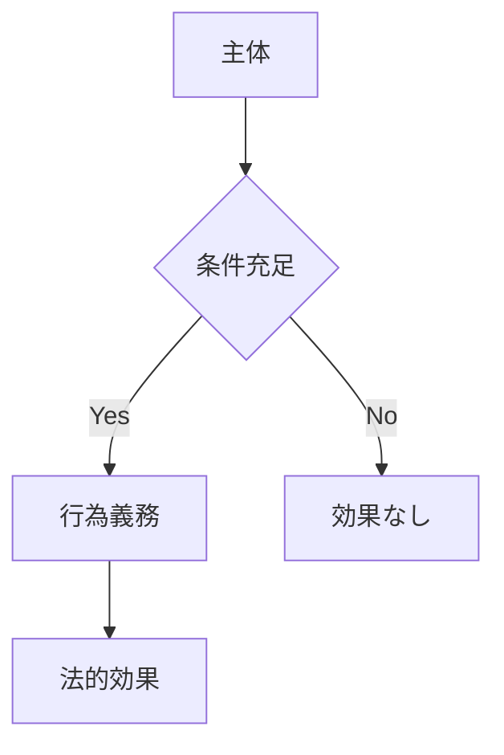

# 〇法n条m項

> 条文本文

# 構造分解

| 要素  |     |
| --- | --- |
| 主体  |     |
| 条件  |     |
| 行為  |     |
| 評価  |     |
| 手続  |     |

```mermaid
flowchart TD

A[主体] --> B{条件充足}
B -->|Yes| C[行為義務]
C --> D[法的効果]

B -->|No| E[効果なし]
```
# 解釈
# 関連条文