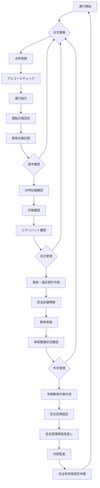

```mermaid
flowchart TD

A[運行開始]

A --> B{日次業務}

B --> B1[点呼実施]
B1 --> B2[アルコールチェック]
B2 --> B3[運行指示]
B3 --> B4[運転日報回収]
B4 --> B5[車両点検記録]

B5 --> C{週次確認}
C --> B

C --> C1[点呼記録確認]
C1 --> C2[日報確認]
C2 --> C3[ヒヤリハット確認]

C3 --> D{月次管理}
D --> B

D --> D1[事故・違反統計作成]
D1 --> D2[安全会議開催]
D2 --> D3[教育実施]
D3 --> D4[車両整備状況確認]

D4 --> E{年次管理}
E --> B

E --> E1[年間教育計画作成]
E1 --> E2[安全目標設定]
E2 --> E3[安全管理規程見直し]
E3 --> E4[内部監査]
E4 --> E5[安全性評価認定申請]

E5 --> A
```
