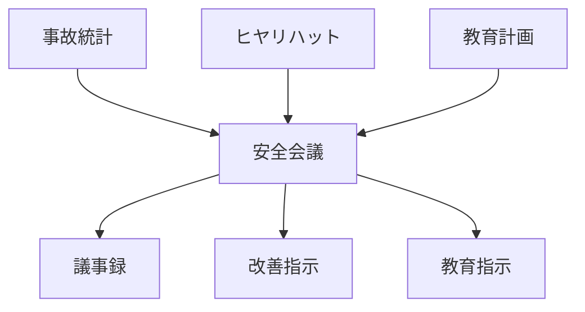
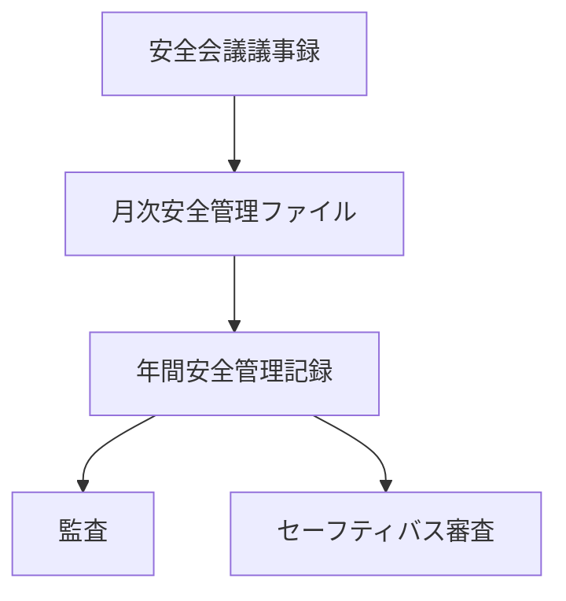

# フォーマット
# 安全会議議事録

## 開催日

YYYY年MM月DD日

## 開催場所

## 出席者

## 議題

### 1 事故・違反報告

### 2 ヒヤリハット報告

### 3 安全教育

### 4 改善事項

## 決定事項

## 次回開催予定
# 年間計画フォーマット
# 年間安全会議計画

| 月   | 開催日 | 主な議題    |
| --- | --- | ------- |
| 1月  |     | 年間安全目標  |
| 2月  |     | 冬季事故防止  |
| 3月  |     | 健康管理    |
| 4月  |     | 新年度安全教育 |
| 5月  |     | 事故分析    |
| 6月  |     | 梅雨期安全   |
| 7月  |     | 夏季安全    |
| 8月  |     | 繁忙期対策   |
| 9月  |     | 事故分析    |
| 10月 |     | 秋季安全    |
| 11月 |     | 冬季準備    |
| 12月 |     | 年間総括    |
# 記録生成フロー

# 記録集積フロー
