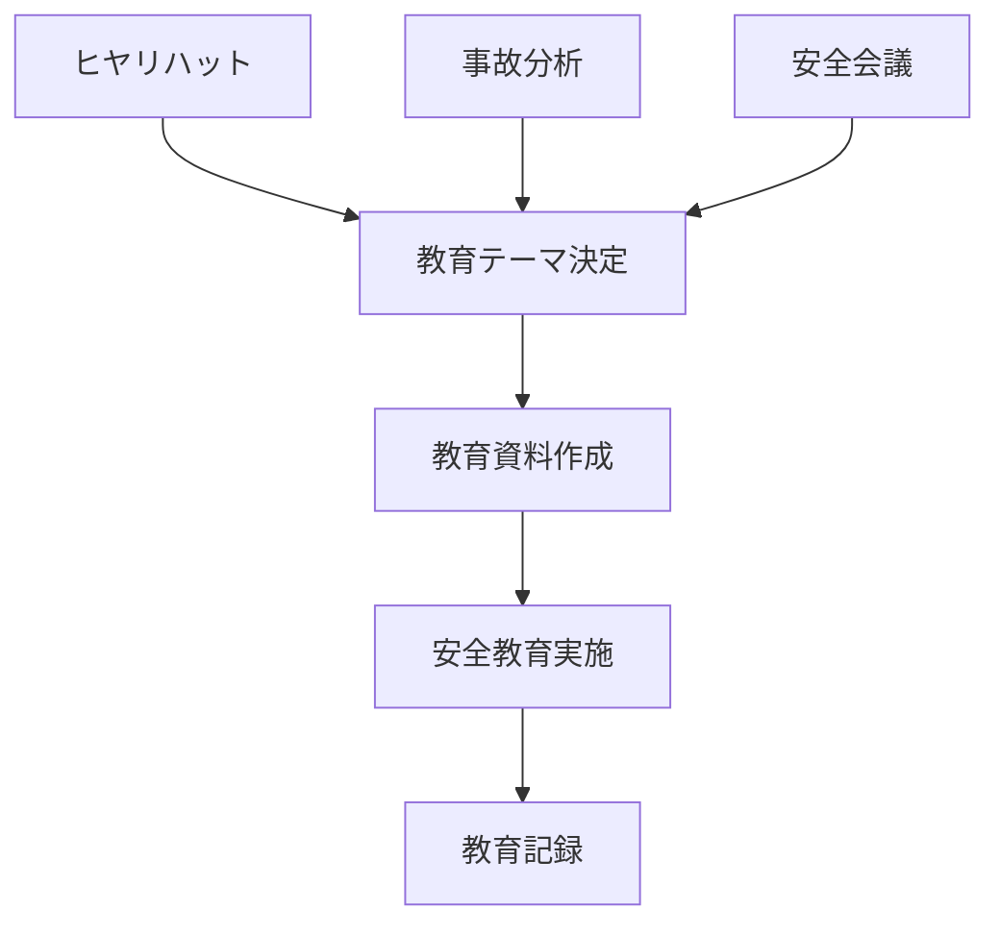
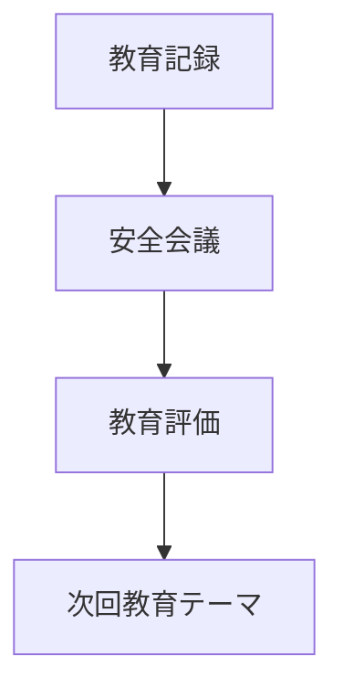
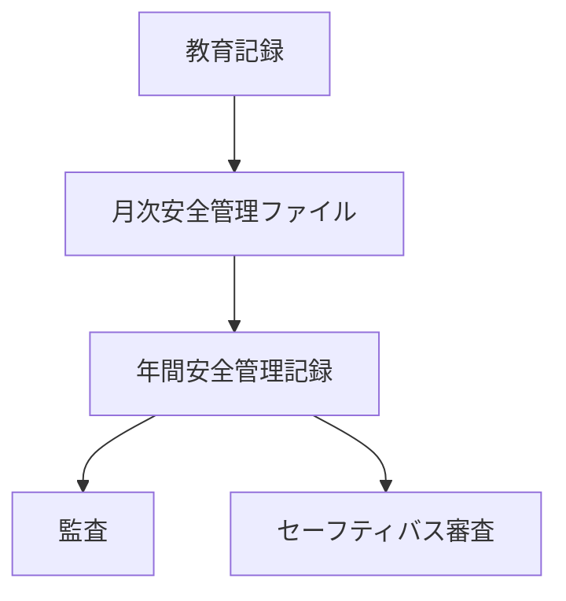

# 年間安全教育計画
- [[年間安全教育計画 フォーマット]]
# 生成フロー

```mermaid
flowchart TD

A[ヒヤリハット]
B[事故分析]
C[安全会議]

A --> D[教育テーマ決定]
B --> D
C --> D

D --> E[教育資料作成]

E --> F[安全教育実施]

F --> G[教育記録]
```

# 教育改善フロー

```mermaid
flowchart TD

A[教育記録]

A --> B[安全会議]

B --> C[教育評価]

C --> D[次回教育テーマ]
```
# 記録集積フロー

```mermaid
flowchart TD

A[教育記録]

A --> B[月次安全管理ファイル]

B --> C[年間安全管理記録]

C --> D[監査]
C --> E[セーフティバス審査]
```
