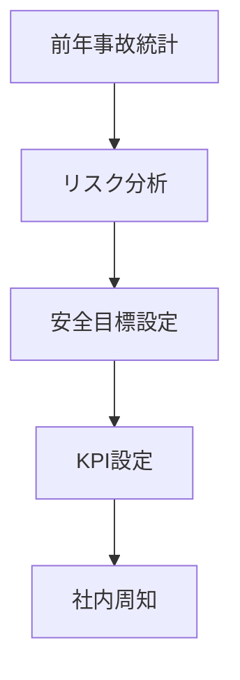
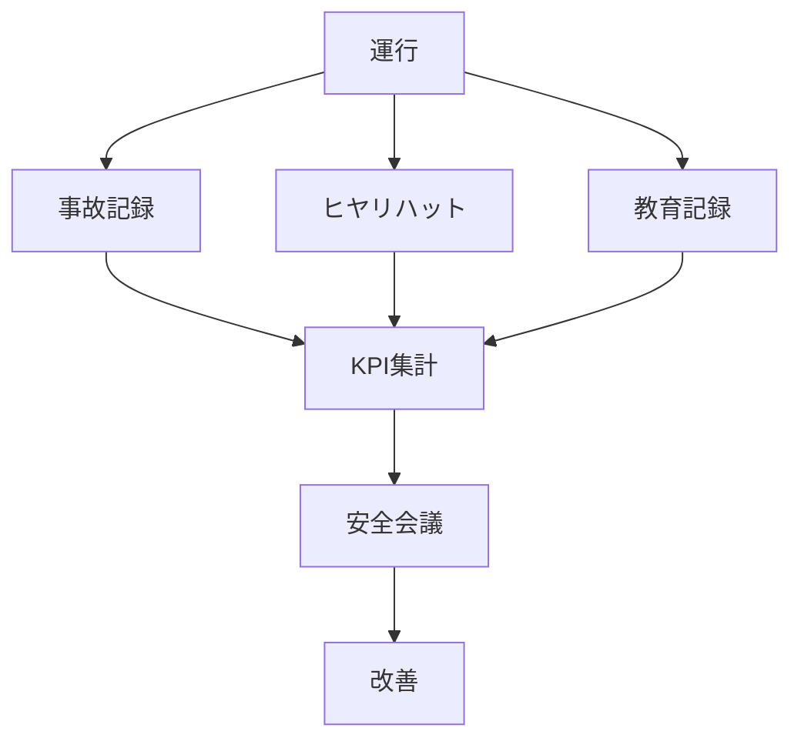
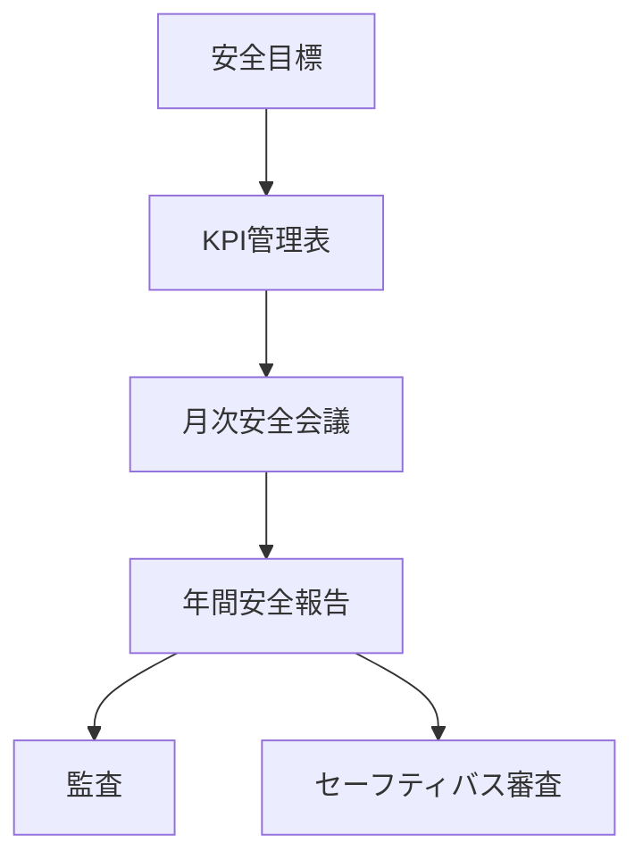

# フォーマット
## 年間安全目標

### 年度

YYYY年度

### 基本方針

安全最優先の運行を徹底し、事故ゼロを目指す。

### 安全目標

| 項目       | 目標    |
| -------- | ----- |
| 交通事故件数   | 0件    |
| 重大事故     | 0件    |
| ヒヤリハット報告 | 月3件以上 |
| 安全教育     | 月1回以上 |

### 重点対策

- ヒヤリハット報告制度強化
    
- 安全教育の継続実施
    
- 車両点検の徹底
    

### 策定日

YYYY年MM月DD日

### 承認

代表取締役

# 目標生成フロー

# KPIモニタリングフロー

# 記録・集積フロー
