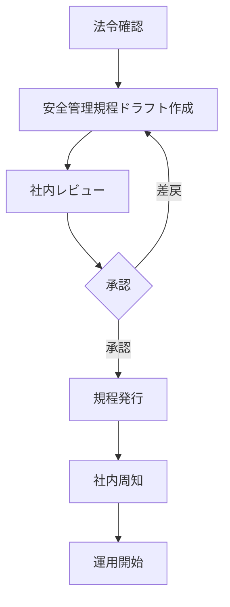
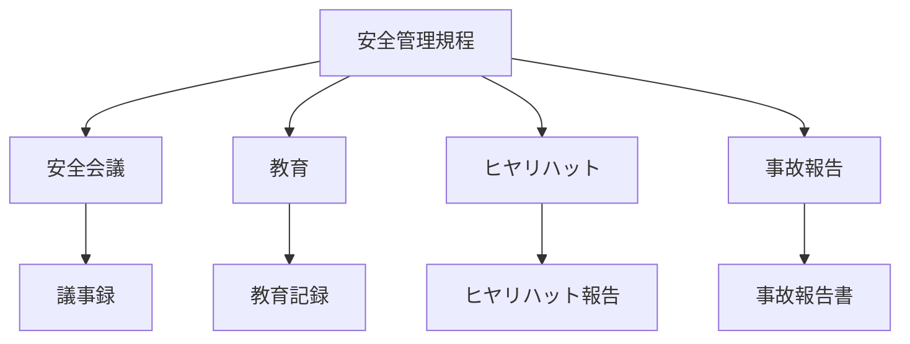
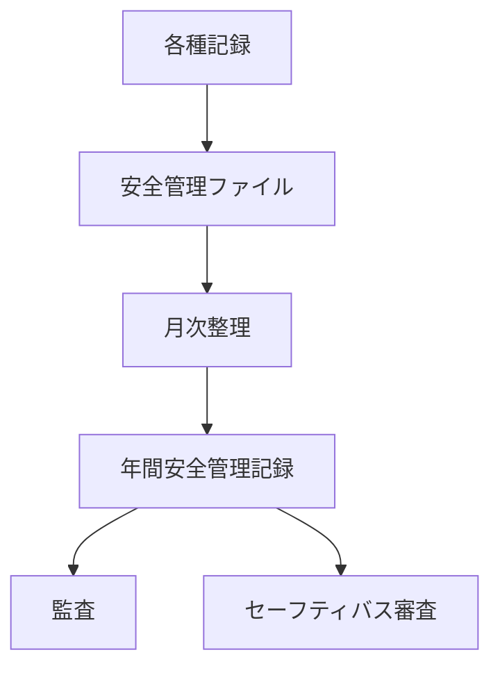

# 安全管理規程

## 1 目的

本規程は安全運行の確保を目的とする。

## 2 適用範囲

本規程は当社の全運行業務に適用する。

## 3 安全管理体制

### 3.1 安全統括管理者

安全管理を統括する。

### 3.2 運行管理者

運行管理業務を実施する。

### 3.3 整備管理者

車両整備を管理する。

## 4 安全管理活動

### 4.1 安全会議

月1回開催する。

### 4.2 教育

年間教育計画に基づき実施する。

### 4.3 ヒヤリハット

全従業員が報告する。

## 5 事故対応

事故発生時は速やかに報告する。

## 6 改訂

必要に応じ改訂する。

# 規定生成フロー

# 記録生成フロー

# 記録集積フロー

