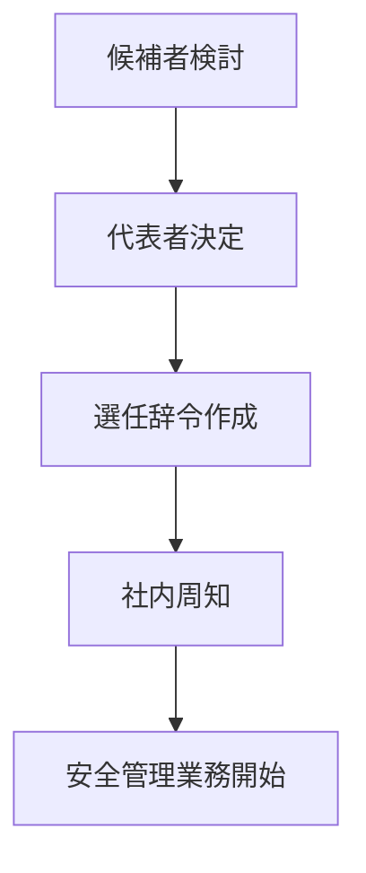
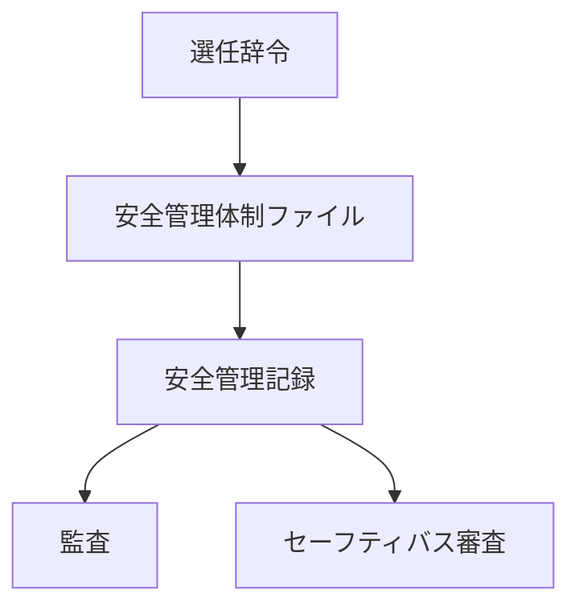
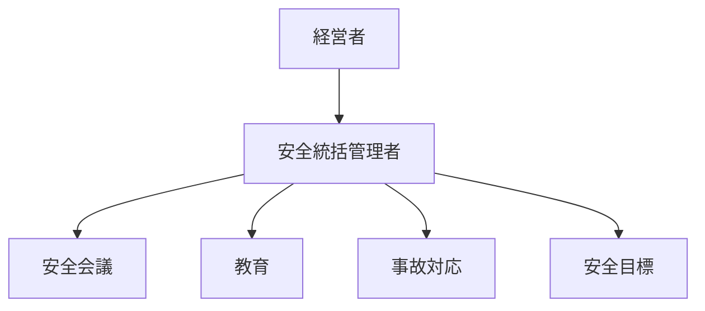

# 選任フォーマット
[[安全統括管理者 辞令フォーマット]]
# 候補者評価フォーマット
[[安全統括管理者 評価フォーマット]]
# 安全統括管理者候補評価
# 選任フロー

```mermaid
flowchart TD

A[候補者検討]

A --> B[代表者決定]

B --> C[選任辞令作成]

C --> D[社内周知]

D --> E[安全管理業務開始]
```
# 記録集積フロー

```mermaid
flowchart TD

A[選任辞令]

A --> B[安全管理体制ファイル]

B --> C[安全管理記録]

C --> D[監査]
C --> E[セーフティバス審査]
```
# 職掌

```mermaid
flowchart TD

A[経営者]

A --> B[安全統括管理者]

B --> C[安全会議]
B --> D[教育]
B --> E[事故対応]
B --> F[安全目標]
```
