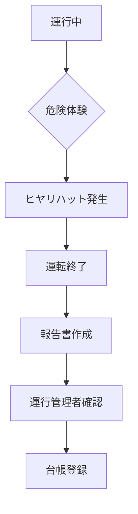
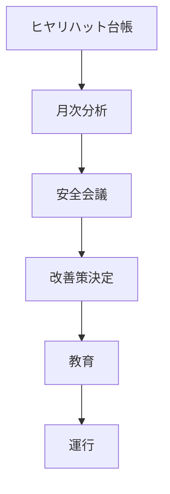

# フォーマット
- [[ヒヤリハット報告フォーマット]]
# ヒヤリハット台帳フォーマット
# ヒヤリハット台帳

- [[ヒヤリハット記録台帳]]
# 生成フロー

```mermaid
flowchart TD

A[運行中]

A --> B{危険体験}

B --> C[ヒヤリハット発生]

C --> D[運転終了]

D --> E[報告書作成]

E --> F[運行管理者確認]

F --> G[台帳登録]
```
# 分析・改善フロー

```mermaid
flowchart TD

A[ヒヤリハット台帳]

A --> B[月次分析]

B --> C[安全会議]

C --> D[改善策決定]

D --> E[教育]

E --> F[運行]
```
# 記録・集積フロー

```mermaid
flowchart TD

A[ヒヤリハット台帳]

A --> B[月次分析]

B --> C[安全会議]

C --> D[改善策決定]

D --> E[教育]

E --> F[運行]
```
