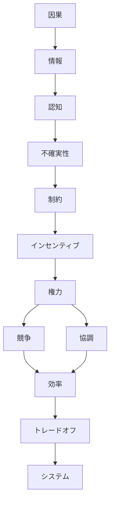

# Engine
思考OSを動かす基本原理（駆動原理）を定義するノート。
Kernelは知識の最下層に位置し、すべての思考・分析・判断のエンジンとなる。
この層は以下の特徴を持つ。
- 分野に依存しない   
- 時代に依存しない
- 抽象度が最も高い
- 思考のルールを定める
例
- 因果
- 制約
- インセンティブ
- 情報
- 権力
- 競争
- 認知
# Understanding
## 世界理解の階層
### 物理・認識レベル
- [[01 因果]]
- [[02 情報]]
- [[03 認知]]
- [[04 不確実性]]

世界は因果で動く 。情報で観測する。人間が認知する。  完全には分からない（不確実性）。
## 制約・行動レベル
- [[05 制約]]
- [[06 インセンティブ]]

制約の中で、人はインセンティブに従って行動する
## 社会レベル
- [[07 権力]]
- [[08 競争]]
- [[09 協調]]

社会関係
## 経済レベル
- [[10 効率]]
- [[11 トレードオフ]]

資源配分

## メタレベル
- [[12 システム]]

全体構造

Kernelは 「世界をどう理解するかの基本枠」 を与える。
この層があることで、バラバラの知識、 分野ごとの理論個別事例を 共通の思考原理で統合できる。
つまり
Kernel
↓
World Model
↓
Problem Solving
↓
Structure
↓
Domain Knowledge
↓
Case
↓
Project
という知識体系の基礎OSに相当する。

# Background
多くの知識体系では
- 哲学
- 経済学
- 認知科学
- システム思考  
などがこの層に該当する。
しかし通常は
- 分野ごとに分断
- 暗黙知    
- 明示されない    
という問題がある。Kernelノートはそれを明示的な思考OSとして管理することを目的とする。

# Example
- 因果関係    
- トレードオフ    
- インセンティブ    
- 情報非対称    
- 権力構造    
- 制約条件    
- 認知バイアス
すべての分野で共通して働く。

# Use
Kernelノートの使い方
## 1思考の原理として参照する
例
観光地の成功
↓
インセンティブ
↓
情報
↓
競争
## 2World Modelを構築する
市場・組織・国家・社会などの世界モデルを、Kernel原理から説明する。
## 3Problem Solvingに接続する
問題は基本的に
- 情報    
- インセンティブ    
- 権力    
- 調整    
- 競争    
- 効率    
のどれかに帰着する。
