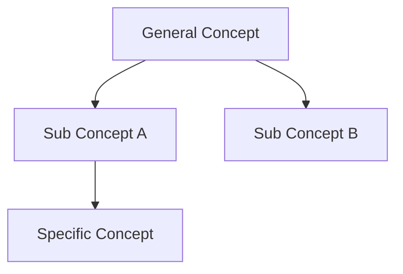

# 概要
概念階層は、概念を階層構造で整理する知識構造モデルである。
複雑な知識体系は、上位概念と下位概念の階層によって整理できる。
# 基本構造

# 階層レベル
| Level  | 意味   |
| ------ | ---- |
| Level1 | 抽象概念 |
| Level2 | カテゴリ |
| Level3 | 具体概念 |
| Level4 | 個別事例 |
# 利点
- 知識整理
- 学習効率向上
- 検索性向上
- 思考の明確化
# よくある問題
階層の混乱
- 抽象度が混在
- 分類軸が混ざる
# 原則
概念階層では、同一レベルは同じ抽象度にする。