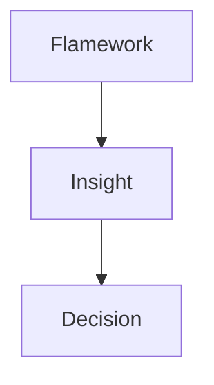
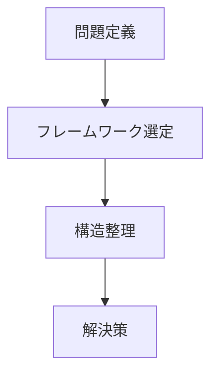
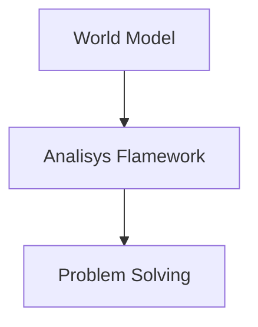

# 概要  
Analysis Frameworkは、問題や現象を分析するための思考の型（framework）である。  
現実の複雑な事象を、分解・構造化・因果分析するための思考ツール群。
Frameworkは、World Model を問題分析に適用する橋渡しになる。
# 分析の基本フロー

# 効果
- 見落としを防ぐ  
- 構造を明確化する  
- 思考を再利用できる
# フレームワーク一覧
## 因果分析  
原因を特定するフレーム  
- [[01 根本原因分析]] 
- [[11 なぜなぜ分析]]
- [[12 因果連鎖分析]]    
## ボトルネック分析  
システムの制約を特定する  
- [[02 ボトルネック分析]]
- [[13 制約分析]] 
## ステークホルダー分析  
利害関係者の構造  
- [[05 ステークホルダー分析]] 
- [[14 パワーマッピング]]]  
## トレードオフ分析  
複数目標のバランス  
- [[03 トレードオフ分析]] 
- [[04 費用便益分析]]  
## 構造分析  
対象の構造理解  
- [[[07 制度]]
- [[08 システムマッピング]]
- [[06 状態遷移モデル]]
# 選び方
問題の種類によって使い分ける  

| Problem Type     | Framework         |
| ---------------- | ----------------- |
| [[01 効率問題]]      | [[02 ボトルネック分析]]   |
| [[02 競争問題]]      | [[07 価値連鎖分析]]     |
| [[03 権力問題]]      | [[05 ステークホルダー分析]] |
| [[04 協調問題]]      | [[08システムマッピング]]   |
| [[05 インセンティブ問題]] | [[09 代理人問題]]      |
| [[06 情報問題]]      | [[10 信号解析]]       |
# 使用の基本  

# 特徴
