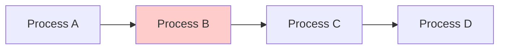
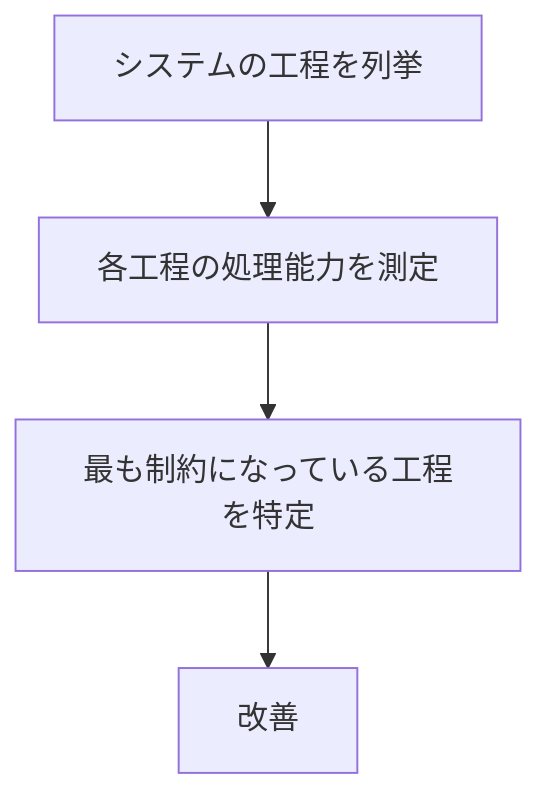
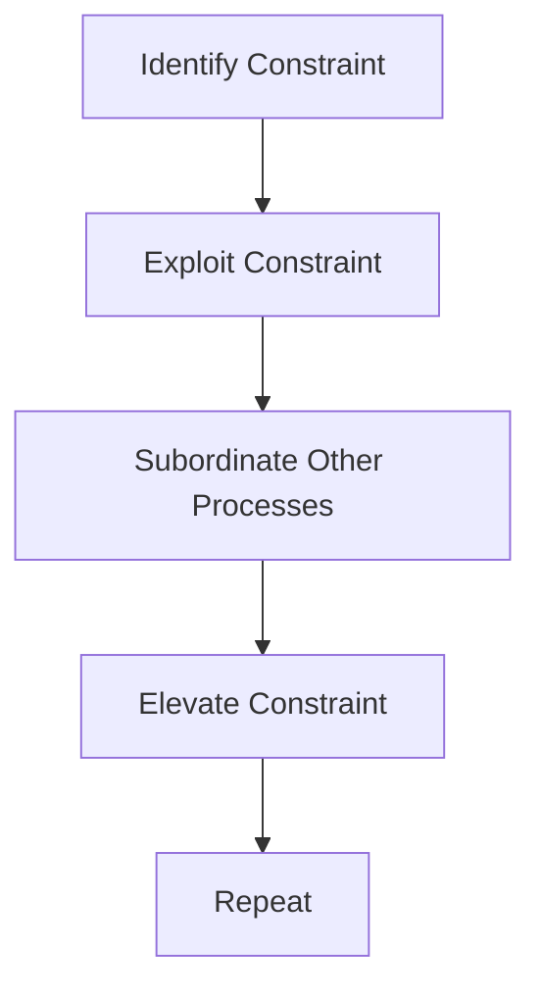

# 概要
Bottleneck Analysis は、システム全体の能力を制限している最も弱い部分（ボトルネック）を特定する分析フレームワークである。
多くのシステムでは、全体能力ではなく最も遅い工程がパフォーマンスを決める。
# 基本原理
もしB が遅い場合、全体速度 = Bになる。

# 手順

# ボトルネック改善の基本サイクル

# よくある誤解
多くの改善は、ボトルネック以外を改善してしまう。しかし、ボトルネック以外の改善は全体性能を変えない。
# 応用
- 業務改善
- 生産管理
- サービス運営
- ITシステム
# 関連ノート
- [[01 根本原因分析]]
- [[03 トレードオフ分析]]
- [[06 状態遷移モデル]]