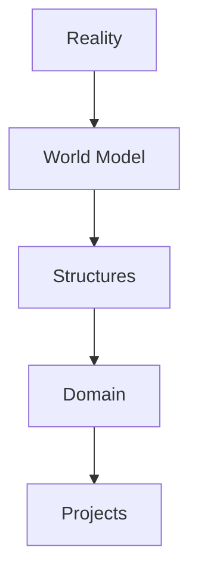
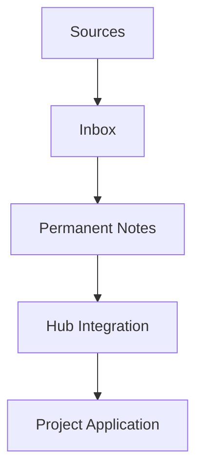

---

note_type: structure  
layer: structure  
status: stable  
maturity: canonical  
related: []  
created: 2026-03-05  
updated: 2026-03-05
---
# Knowledge System

このVaultは「思考OS」である。
目的は、世界理解・問題解決・行動設計を一体化すること。

---

---

# 1 Reality

現実の出来事

- 事例
- 観測
- データ

リンク

[[cases]]

---

# 2 World Model

世界の構造理解

- 個人
- 組織
- 市場
- 社会
- 国家

リンク

[[world_model]]

---

# 3 Kernel

普遍原理

- 因果
- 制約
- インセンティブ
- 情報
- 権力
- 競争
- 協調
- 不確実性

リンク

[[kernel]]

---

# 4 Structures

分析フレーム

例

- 要件→効果構造
- 例外構造
- 禁止→罰則構造
- 状態遷移構造
- ネットワーク構造

リンク

[[structures]]

---

# 5 Domain Knowledge

分野知識

- law
- tourism
- business
- transport
- fashion
- history

リンク

[[domain]]

---

# 6 Projects

実行

- Bus Safety OS
- Tourism OS
- Legal OS
- Dispatch SaaS

リンク

[[projects]]

---

# Thinking Flow

問題解決の流れ

---

# Knowledge Creation Loop

---

# AI Interaction

AIは以下の順序で推論する

1 世界構造理解
2 原理適用
3 分析フレーム選択
4 分野知識適用
5 実行案生成

---

# Navigation

## Core

[[kernel]]
[[world_model]]
[[structures]]

## Knowledge

[[domain]]

## Practice

[[projects]]
[[cases]]

---

# System Maintenance

このHubは以下を管理する

- 知識構造
- ノート分類
- 思考フロー
- AIインターフェース