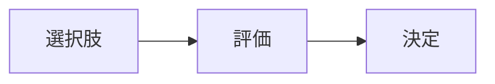

---
note_type:
  - parmanent
layer:
  - problem_sloving
status:
  - stable
maturity:
  - refined
domain:
related: []
problem_type:
  - efficiency
  - competiton
  - power
  - coordination
  - incentive
  - information
created: 2026-03-05
updated: 2026-03-05
---
意思決定とは、複数の選択肢から最適な行動を選ぶプロセスである。  
# Translation  
decision making    
# Engine  
## 要素  
- 選択肢  
- 評価  
- 選択  
## 構造  
  

# Understanding
意思決定は、
- [[04 不確実性]]    
- [[11 トレードオフ]]    
- [[06 インセンティブ]]
に影響される。
# Background
多くの意思決定は、不確実性の中で行われる。
# Example
投資判断
# Use
- 経営
- 政策
- 戦略