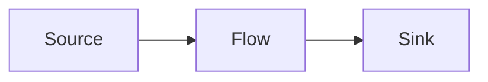

---
note_type:
  - parmanent
layer:
  - system_model
status:
  - stable
maturity:
  - canonical
domain: knowledge_architecture
related:
problem_type:
created: 2026-03-05
updated: 2026-03-06
---
フローモデルとは、物質・情報・資源などがシステム内を流れる過程を表すモデルである。
# Translation
flow model

# Engine
フローの要素
- 起点
- 流れ
- 終点
フロー構造

フローモデルは、起点 → 流れ → 終点という構造を持つ。
# Understanding
フローモデルは、
- [[12 システム]]    
- [[10 効率]]    
- [[02 情報]]    
の理解に役立つ。
フローは、資源や情報の移動を表す。
# Background
フローモデルは、
- 物流
- 経済循環
- 情報伝達
などの分析から発展した。
多くの社会システムは、流れによって動く。
# Example
物流

# Use
- 物流分析
- 情報伝達
- 経済循環
- 業務プロセス