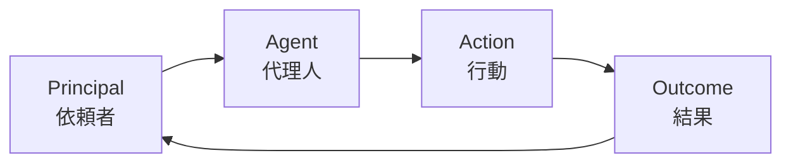
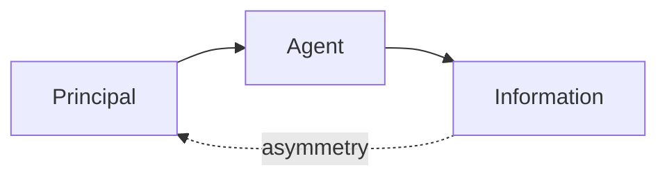

---
note_type:
  - parmanent
layer:
  - system_model
status:
  - stable
maturity:
  - canonical
domain: knowledge_architecture
related:
problem_type:
created: 2026-03-05
updated: 2026-03-06
---
プリンシパル＝エージェントモデルとは、意思決定を委任する主体（プリンシパル）と、その代理として行動する主体（エージェント）の関係を分析するモデルである。
# Translation
principal-agent model
# Engine
## 要素
- プリンシパル
- エージェント
- 情報格差
- インセンティブ
## 構造

# Understanding
プリンシパル＝エージェントモデルは,
- [[06 インセンティブ]]    
- [[02 情報]]    
- [[07 権力]]    
- [[04 制度]]    
の理解に役立つ。
代理関係では、情報格差が問題になる。

# Background
プリンシパル＝エージェント理論は、
- 経済学    
- 組織理論    
- 契約理論
などで発展した。
多くの組織問題は、代理問題として説明できる。
# Example
企業

# Use
- 組織設計    
- 契約設計    
- インセンティブ設計    
- ガバナンス分析