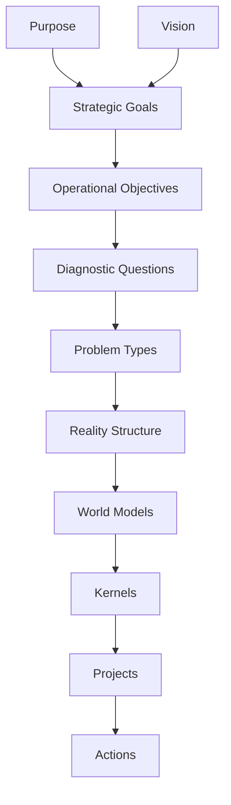

# 概要

# 構造
## 目的層
- [[01 目的]]
- [[02 ビジョン]]
- [[03 戦略的目標]]
- [[04 運用目標]]
## ## 問題理解層
- [[diagnostc question]]
- [[00 problem_type hub]]
## 世界理解層
- [[reality structure]]
- [[00 World_Model Hub]]
- [[00 Kernel]]
## 実行層
- [[projects]]
- [[action]]