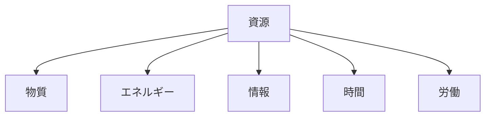

---
note_type:
  - parmanent
layer:
  - world_model
status:
  - stable
maturity:
  - canonical
domain:
related: []
problem_type:
  - power
  - coordination
  - efficiency
  - competiton
  - information
created: 2026-03-05
updated: 2026-03-06
---
資源とは、人間の行動や社会活動に利用できる価値あるものの総称である。
# Translation
resource
# Engine
## 要素
- 物質
- エネルギー
- 情報
- 時間
- 労働

## 構造

資源は、利用可能な価値である。
# Understanding
資源は、
- [[08 市場]]    
- [[07 組織]]    
- [[09 国家]]    
- [[04 制度]]    
- [[02 技術]]
に大きな影響を与える。
資源は、社会活動の基盤である。

# Background
社会は資源を巡って発展する。
例
- 農地 → 農業社会    
- 石炭 → 産業革命    
- 石油 → 工業社会    
- データ → 情報社会   
資源の変化は、社会構造の変化を引き起こす。
# Example
資源の例
- 土地    
- エネルギー
- 資本   
- データ    
- 人
- # Use
- 経済分析
- 組織戦略    
- 国家戦略
- 技術発展