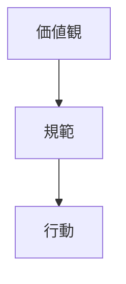

---
note_type:
  - parmanent
layer:
  - world_model
status:
  - stable
maturity:
  - canonical
domain:
related: []
problem_type:
  - power
  - information
created: 2026-03-05
updated: 2026-03-05
---
文化とは、人々の価値観・規範・象徴の体系である。
# Translation
culture
# Engine
## 要素
- 価値観
- 社会規範
- 象徴
- 習慣
## 作用

# Understanding
文化は、
- [[12 システム]]
- [[04 制度]]
- [[05 ネットワーク]]
に影響する。
文化は、行動の期待値を形成する。
# Background
文化は社会秩序を支える。
例
- 武士道 → 日本の封建秩序
- プロテスタント倫理 → 資本主義
- 個人主義 → 西洋社会
# Example
文化の例
- 礼儀    
- 宗教    
- 価値観    
- 社会規範
# Use
文化モデルは
- 社会分析
- 組織文化
- 国際比較
の分析に使う。