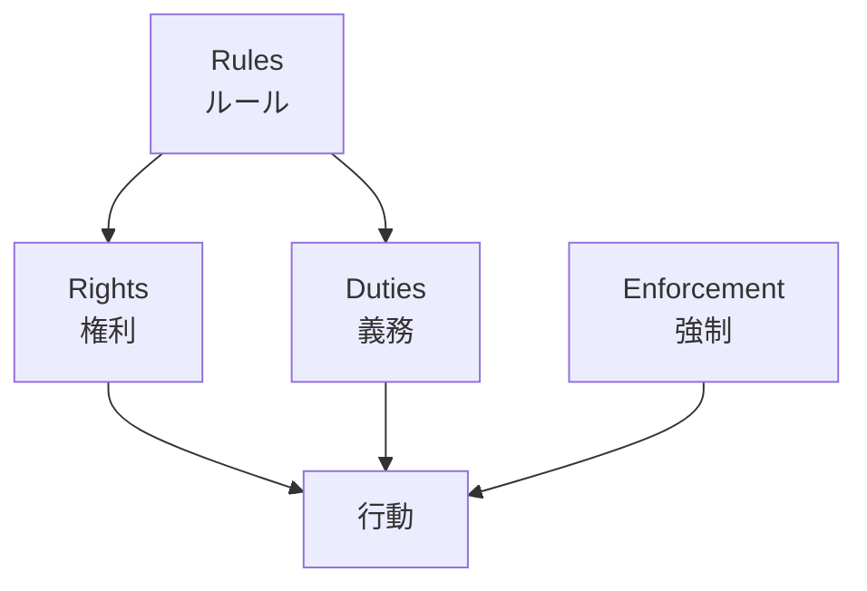

---
note_type:
  - parmanent
layer:
  - world_model
status:
  - stable
maturity:
  - canonical
domain:
related: []
problem_type:
  - power
  - incentive
created: 2026-03-05
updated: 2026-03-05
---
制度とは、人々の行動を規定するルールの体系である。
# Translation
institution
# Engine
## 要素
- ルール
- 権利
- 義務
- 強制
## 制度の構造
制度とは、ルールから行動を作る。

# Understanding
制度は
- [[10 効率]]    
- [[08 権力]]    
- [[12 システム]]    
に大きな影響を与える。
制度は、行動の予測可能性を作る。

# Background
制度は社会秩序を形成する。
例
- 所有権 → 市場経済    
- 契約法 → 商取引    
- 官僚制 → 国家統治
制度は、長期的な社会構造を作る。
# Example
制度の例
- 法律 
- 契約
- 市場
- 官僚制
- 選挙制度
# Use
- 法律分析
- 経済制度分析
- 組織設計
- 社会構造分析