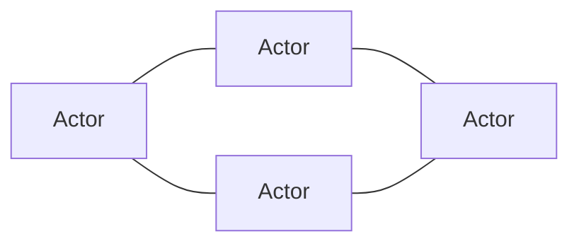
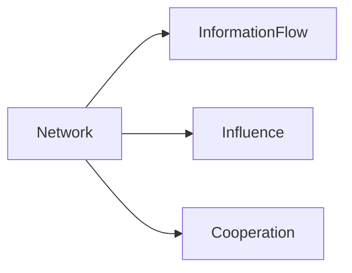

---
note_type:
  - parmanent
layer:
  - world_model
status:
  - stable
maturity:
  - canonical
domain:
related: []
problem_type:
  - power
  - coordination
  - information
created: 2026-03-05
updated: 2026-03-06
---
紐帯とは、人や組織の関係構造である。

# Translation
network
# Engine
紐帯の要素
- ノード
- 関係
- 中心性
- 密度

ネットワーク構造

紐帯は、ノードと関係によって構成される。
# Understanding
ネットワークは
- [[02 情報]]
- [[10 効率]]    
- [[08 権力]]    
- [[12 システム]]   
に大きな影響を与える。
ネットワークは、情報と影響力の流れを決める。

# Background
紐帯は、社会構造を作る。
例
- 商人ネットワーク → 国際貿易
- 学術ネットワーク → 知識拡散
- SNS → 情報社会
紐帯は、社会の見えないインフラとして機能する。
# Example
ネットワークの例
- 人脈
- 取引関係
- コミュニティ
- SNS
# Use
- 組織分析
- 市場分析
- 情報拡散
- 権力構造分析