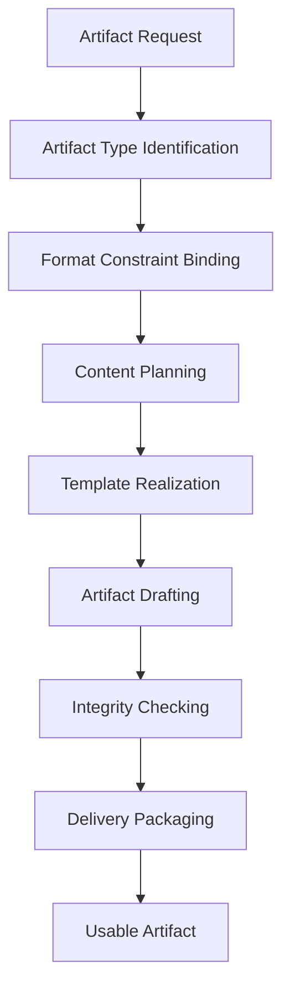
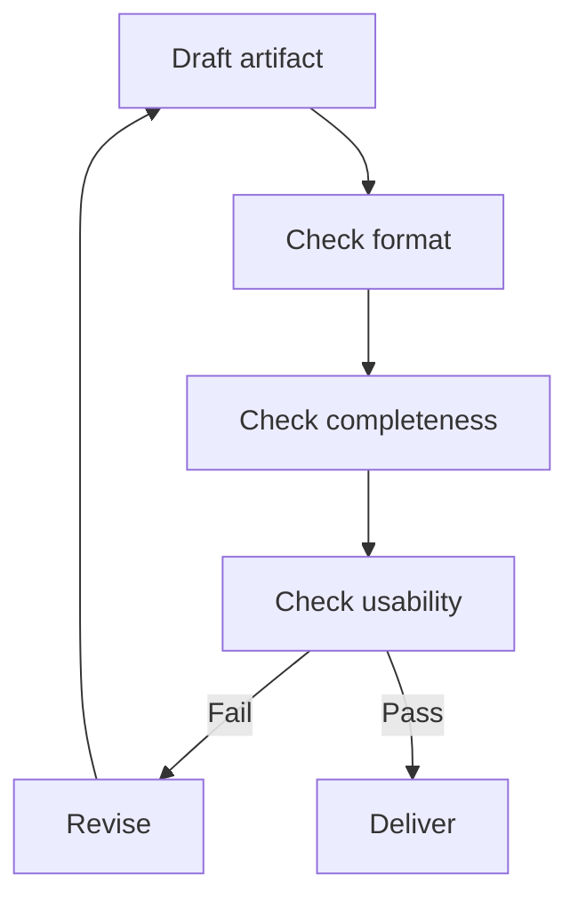

# Artifact Generation Mode

Artifact Generation Mode は、回答文ではなく、**ユーザーがそのまま使える成果物そのものを完成させる運転モード**である。  
ここでいう成果物とは、ノート、文書、コード、表、設定ファイル、スライド構成、テンプレートなど、**再利用・保存・貼り付け・実行の対象となる具体物**を指す。

---

# 要点

- このモードの目的は説明ではなく完成物の生成である
- 形式適合性と再利用性が特に重要になる
- 中身の正しさだけでなく、貼り付け可能性・実行可能性・編集可能性が求められる
- 説明文は補助であり、本体は成果物である
- 完成条件は「読める」ではなく「使える」で判断する

---

# なぜ必要か

ユーザーはしばしば、知識説明ではなく具体物を求める。

例:
- ノート本文を作って
- そのまま貼れる形で出して
- Mermaid付きで構造化して
- JSONで返して
- コードを書いて
- テンプレートを作って
- スプレッドシートやスライドの元案を作って

このような依頼では、分析や説明だけでは足りない。  
必要なのは、**仕様に合った完成物を出すこと**である。

そのため Artifact Generation Mode は、**推論結果を成果物へ変換する専用モード**として必要になる。

---

# 適用場面

## 1. ノート生成
例:
- Obsidianノート
- Hubノート
- Structureノート
- テンプレートノート

## 2. コード生成
例:
- Python
- SQL
- JSON
- YAML
- Mermaid
- HTML

## 3. 文書生成
例:
- 提案書
- メール草案
- 契約テンプレート
- 説明資料本文

## 4. 構造化成果物生成
例:
- 表
- チェックリスト
- 手順書
- スキーマ
- データ定義

---

# 適用してはいけない場面

- 単なる質問応答
- 軽い意見交換
- 根拠確認が先の案件
- まず比較や分析が必要で、成果物形が未定の場面

この場合は Direct Answer Mode や Comparative Reasoning Mode を先行させる方がよい。

---

# 中核機能

## 1. Artifact Type Identification
何を作るのかを特定する。

対象:
- ノート
- コード
- 文章
- 表
- 設計書
- スライド骨子
- データ形式
- 設定ファイル

成果物タイプによって、完成条件が大きく変わる。

---

## 2. Format Constraint Binding
形式要件を明確に取り込む。

例:
- コードブロックで出す
- YAML frontmatter を含める
- Mermaidを閉じる
- JSON valid にする
- Markdownで整形する
- 表の列構成を守る

Artifact Generation では、形式要件は本質的要件である。

---

## 3. Content Planning
成果物の中身を組み立てるための構成案を立てる。

内容:
- セクション構成
- 項目順
- 必須要素
- 再利用単位
- 見出し体系
- 依存部品

---

## 4. Template Realization
必要に応じてテンプレートや定型構造へ落とし込む。

例:
- frontmatter
- 見出しテンプレート
- 関連ノート欄
- コード雛形
- 変数配置
- 表形式の列

---

## 5. Artifact Drafting
実際の成果物本文を生成する。

この段階では、説明の美しさよりも、
- そのまま使えるか
- 仕様を守っているか
- 欠けがないか

が重要になる。

---

## 6. Integrity Checking
成果物として成立しているかを確認する。

確認項目:
- 形式が壊れていないか
- 必須要素が揃っているか
- コードブロックが閉じているか
- Markdown構造が破綻していないか
- セクション順が妥当か

---

## 7. Delivery Packaging
成果物本体と、必要最小限の補足を分けて提示する。

原則:
- 本体優先
- 補足は短く
- 余計な説明で成果物を埋めない

---

# 成果物生成の基本形

1. 何を作るか決める
2. 形式要件を確認する
3. 構成を設計する
4. 本文を生成する
5. 壊れていないか検査する
6. そのまま使える形で渡す

---

# 下位構造

## A. Artifact Spec Reader
成果物仕様を読む部分。

## B. Structure Planner
成果物構成を設計する部分。

## C. Template Binder
定型部品を接続する部分。

## D. Draft Generator
本文を作る部分。

## E. Integrity Checker
形式破綻や欠落を検査する部分。

## F. Delivery Formatter
本体を使いやすい形で提示する部分。

---

# 全体構造

---

# 生成検査ループ

---

# 典型例

|入力|Artifact Generation Mode の動き|
|---|---|
|ノートを作って|frontmatter付き本文を完成させる|
|コードを書いて|実行可能性を意識して生成する|
|Mermaidで図を書いて|構文破綻なく図を生成する|
|表にして|列構成を保って出す|
|貼り付ける部分だけ|本体のみを整形して返す|

---

# よくある失敗

## 1. 説明が本体を食う

成果物より前置きが長くなる。

## 2. 形式が壊れる

コードブロックやJSONやMermaidが閉じない。

## 3. 仕様漏れ

frontmatterや必須欄が欠ける。

## 4. 使えない完成物になる

読めるが、そのまま貼れない・実行できない。

## 5. 本体と補足が混ざる

ユーザーがどこを使えばよいか分かりにくくなる。

---

# 設計原則

- 成果物本体を最優先する    
- 形式要件を最初に固定する    
- 構成を先に設計する    
- テンプレートを活用する    
- 生成後に必ず整合性を確認する    
- 補足より再利用性を重視する    
- そのまま使える状態で渡す    

---

# 位置づけ

Artifact Generation Mode は、  
**推論や設計の結果を、実際に使える完成物へ変換する成果物生成モード**である。

これが強いと、

- 回答が作業成果へ直結し    
- ユーザーの手直しが減り    
- LLMが実務制作パートナーとして機能する    

したがってこのモードは、単なる文章生成ではなく、  
**仕様拘束下で使える成果物を完成させる制作実行モード**である。

---

# 関連ノート

- [[Mode Selection]]    
- [[Comparative Reasoning Mode]]    
- [[Stepwise Reasoning Mode]]    
- [[Direct Answer Mode]]    
- [[LLM Output Layer]]    
- [[Tool Orchestration]]