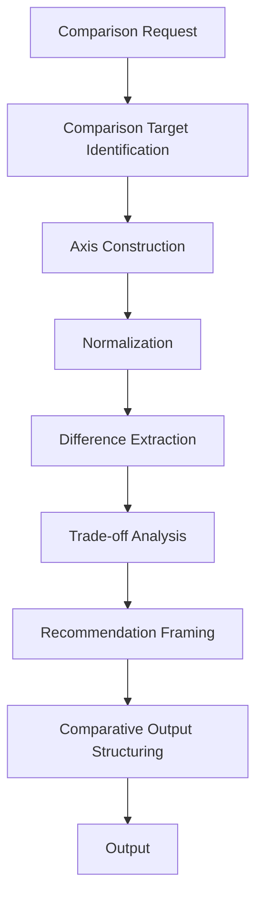
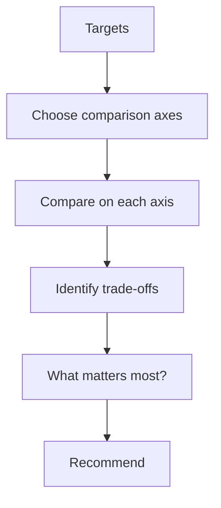

# Comparative Reasoning Mode

Comparative Reasoning Mode は、複数の対象・案・解釈・選択肢を、**同一の比較軸の上に並べ、差分・優劣・適合条件を明らかにする運転モード**である。  
このモードの本質は、単に「違いを並べる」ことではなく、**何を基準に比べるべきかを定め、その基準に照らして判断可能な形へ整理すること**にある。

---

# 要点

- 比較では、対象そのもの以上に比較軸の設計が重要である
- 差分列挙だけでなく、どの条件でどちらが有利かを示す
- 比較対象が複数でも、基準はできるだけ共通化する
- 結果は一覧化だけでなく、判断支援へつなげる
- 比較モードは、分析・意思決定・提案設計の中間に位置する

---

# なぜ必要か

ユーザーの依頼には、次のような比較要求が多い。

- AとBの違いを知りたい
- どちらがよいか判断したい
- 選択肢を並べた上で推奨が欲しい
- 類似概念の境界を知りたい
- 複数案の長所短所を整理したい

このとき、単なる特徴列挙では足りない。  
必要なのは、

- どの観点で比べるのか
- どこが本質的差分なのか
- 何を重視すると結論が変わるのか

を明らかにすることである。

そのため Comparative Reasoning Mode は、**比較可能性を設計し、判断可能性へ変換する専用モード**として必要になる。

---

# 適用場面

## 1. 選択肢比較
例:
- この2案のどちらがよいか
- A案とB案を比較して
- 候補を並べて推奨して

## 2. 概念比較
例:
- structureとmechanismの違い
- hubとindexの違い
- policyとruleの違い

## 3. 文書比較
例:
- 2つの提案書の差分
- バージョン比較
- 条項差分の整理

## 4. 解釈比較
例:
- この読み方とあの読み方の違い
- どの見解がより妥当か
- 論点ごとの評価をして

---

# 適用してはいけない場面

- 単純な定義説明だけで足りる場合
- 比較対象が一つしかない場合
- 比較より因果分析が本体の場合
- ユーザーが明確な完成物だけを求めている場合

この場合は Direct Answer Mode や Stepwise Reasoning Mode の方が適切である。

---

# 中核機能

## 1. Comparison Target Identification
何と何を比較するのかを特定する。

対象は、
- 概念
- 案
- 製品
- 文書
- 主張
- 時点
- 戦略
- 手法

など多様である。  
この段階では、比較単位を揃えることが重要である。

---

## 2. Axis Construction
どの観点で比べるかを設計する。

代表軸:
- 目的適合性
- コスト
- 速度
- 精度
- 柔軟性
- 安全性
- 拡張性
- 理解しやすさ
- 実装容易性

比較軸が悪いと、比較は浅くなる。  
このモードでは、**比較軸設計が中心作業**である。

---

## 3. Normalization
異なる対象を、比較可能な形へ揃える。

例:
- 用語レベルを揃える
- 比較単位を揃える
- 時点を揃える
- 評価基準を揃える
- 不均等な情報量を補正する

---

## 4. Difference Extraction
比較軸ごとに差分を抽出する。

ここで重要なのは、
- 表面的差分
- 本質的差分
- 条件付き差分

を分けることである。

---

## 5. Trade-off Analysis
各対象の強みと弱みの交換関係を整理する。

例:
- 精度は高いが遅い
- 柔軟だが管理コストが高い
- 簡単だが拡張性が低い

単なる優劣ではなく、**何を取って何を捨てるか**を明示する。

---

## 6. Recommendation Framing
比較結果から、どの条件でどれを推奨するかを組み立てる。

形式:
- 一般推奨
- 条件付き推奨
- 用途別推奨
- 優先順位別推奨

---

## 7. Comparative Output Structuring
比較結果を、表・箇条書き・整理文として出力する。

このモードでは、
- 比較軸
- 差分
- 結論
- 推奨条件

が一目で見える構造が望ましい。

---

# 比較の基本構造

比較はしばしば次の形を取る。

1. 比較対象を確定する
2. 比較軸を決める
3. 軸ごとの差分を出す
4. トレードオフを整理する
5. 条件付きで結論を出す

---

# 下位構造

## A. Target Pairer
比較対象を定める部分。

## B. Axis Builder
比較軸を設計する部分。

## C. Difference Mapper
軸ごとの差分を整理する部分。

## D. Trade-off Analyzer
得失の交換関係を分析する部分。

## E. Recommendation Binder
比較結果を推奨へ結びつける部分。

---

# 全体構造

---

# 比較判断ループ

---

# 典型例

|入力|Comparative Reasoning Mode の動き|
|---|---|
|AとBの違いは|比較軸を立てて差分を整理する|
|どちらがよいですか|条件付き推奨まで出す|
|structureとmechanismを比較して|定義・役割・使い方で比べる|
|2案を評価して|評価軸を設定して採点・整理する|
|この2資料の差分は|同項目比較を行う|

---

# よくある失敗

## 1. 比較軸なしで並べる

特徴列挙になってしまい、比較にならない。

## 2. 表面的差分だけ見る

本質的な違いが見えない。

## 3. 優劣を一律に断定する

条件によって結論が変わるのに単純化しすぎる。

## 4. 情報量の偏りを放置する

片方だけ詳しく、比較が不公平になる。

## 5. 結論がない

比較表だけ出して、判断支援に至らない。

---

# 設計原則

- まず比較軸を立てる    
- 比較単位を揃える    
- 差分と共通点の両方を見る    
- トレードオフを明示する    
- 条件付き推奨を許容する    
- 比較結果を判断へつなげる    

---

# 位置づけ

Comparative Reasoning Mode は、  
**複数対象を比較可能な形へ整え、差分を判断材料へ変換する比較駆動モード**である。

これが強いと、

- 違いが明確になり    
- 選択理由が見え    
- 推奨の根拠も整理される    

したがってこのモードは、単なる一覧化ではなく、  
**比較を通じて意思決定可能性を高める評価整理モード**である。

---

# 関連ノート

- [[02_zettelkasten/00_system/Mode Selection]]    
- [[Stepwise Reasoning Mode]]    
- [[Artifact Generation Mode]]    
- [[Direct Answer Mode]]    
- [[Termination Control]]    
- [[LLM Output Layer]]