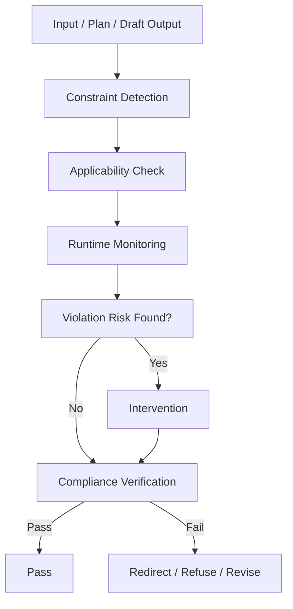
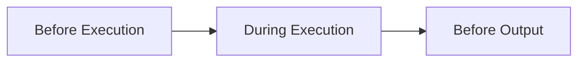

# Constraint Monitor

Constraint Monitor は、LLM の処理全体に対して、**守るべき条件・越えてはいけない境界・満たすべき形式要件**を監視し続ける構造である。  
これは単なる安全フィルタではなく、**実行前・実行中・出力前の各段階で制約違反を防ぎ、必要なら進路を修正する監督機構**である。

---

# 要点

- 制約は最後にまとめて確認するのではなく、全工程にかける
- 制約には安全だけでなく、形式・鮮度・根拠・権限・ユーザー指定も含まれる
- Constraint Monitor は「禁止」を判定するだけでなく、進路変更も行う
- 制約違反を完全拒否にせず、可能なら安全な代替経路へ誘導する
- 良い応答は、内容の正しさだけでなく制約遵守でも評価される

---

# 制約とは何か

ここでいう制約とは、LLM が自由に出力・行動してよい範囲を限定する条件群である。  
主なものは以下である。

- 安全制約
- 法的・倫理的制約
- ユーザー指示制約
- フォーマット制約
- 最新性確認制約
- 引用制約
- ツール使用規則
- 接続ソース制約
- 長さ・粒度・言語制約
- 権限制約

Constraint Monitor は、これらを一つの監視系として扱う。

---

# 中核機能

## 1. Constraint Detection
入力・計画・ツール利用・出力案の各段階から、関係する制約を抽出する。

例:
- 「最新情報」→ web確認制約
- 「JSONで」→ 形式制約
- 「送って」→ 外部書き込み制約
- 医療・法律・金融 → 高精度確認制約
- 添付ファイルあり → 根拠限定制約
- 明確な危険意図 → 安全制約

---

## 2. Applicability Check
その制約が今回のケースに本当に適用されるかを判定する。

同じ制約でも、すべてのタスクに一律適用されるわけではない。  
たとえば、

- 一般知識の説明なら web不要
- 最新株価なら finance必須
- PDF分析なら PDF読解手順が必要
- メール送信は、下書きか即送信かを区別する

Constraint Monitor は、**何が適用対象か**を見極める。

---

## 3. Ongoing Monitoring
処理途中で制約違反の兆候が出ていないかを継続監視する。

監視対象:
- 記憶だけで最新情報に答えようとしていないか
- 許可なく外部変更しようとしていないか
- フォーマット逸脱が起きていないか
- 根拠の薄い断定が混じっていないか
- 禁止領域へ深掘りしていないか

---

## 4. Intervention
違反または違反リスクを見つけたとき、進行を修正する。

修正方法:
- web検索へ切り替える
- 出力形式を再構成する
- 拒否モードへ切り替える
- 代替案へ誘導する
- ツール使用順を変更する
- 断定表現を緩和する

つまり Monitor は、受動的警報機ではなく、**能動的介入機構**である。

---

## 5. Compliance Verification
最終出力直前に、主要制約を満たしているかを検査する。

検査項目:
- 指定言語か
- 指定形式か
- 必要な引用があるか
- 必要な最新確認を行ったか
- 禁止表現がないか
- 書き込み行為がユーザー意図に合うか
- 不確実性の扱いが適切か

---

## 6. Constraint Logging
何の制約をどう適用したかを内部的に保持できるようにする。

利点:
- 同じ誤りの再発防止
- 処理判断の一貫性向上
- 後続層への引き継ぎ
- 部分達成の説明容易化

---

# 制約の主要分類

## A. Safety Constraint
危険行為、有害支援、プライバシー侵害、不適切内容を制御する。

## B. Freshness Constraint
最新情報が必要な場合、外部確認を必須にする。

## C. Format Constraint
JSON、コードブロック、表、文書形式などの指定を守らせる。

## D. Grounding Constraint
ファイル・引用・根拠に基づく回答を要求する。

## E. Permission Constraint
メール送信、予定作成、削除など外部変更の権限条件を監視する。

## F. Instruction Constraint
ユーザーの明示指示や会話内ルールを守らせる。

## G. Scope Constraint
聞かれた範囲を超えすぎないようにする。

---

# 下位構造

## A. Constraint Extractor
入力やタスクから制約候補を抽出する部分。

## B. Constraint Classifier
制約の種類と優先度を分類する部分。

## C. Runtime Watcher
処理途中の制約逸脱を監視する部分。

## D. Compliance Gate
最終出力前の通過判定を行う部分。

## E. Safe Redirector
違反時に拒否・縮退・代替案提示へ導く部分。

---

# 全体構造

---

# 制約監視の時間軸

---

# 典型介入例

|状況|介入内容|
|---|---|
|最新情報を記憶で答えそう|web検索を挿入する|
|JSON指定なのに解説文が混ざる|出力構造を再整形する|
|危険手順へ踏み込みそう|拒否または抽象化へ切り替える|
|根拠不十分な断定がある|表現を弱める|
|ユーザー指定言語から逸脱|言語を戻す|
|外部変更が曖昧|実行せず草案化する|

---

# よくある失敗

## 1. 制約を最後にしか見ない

途中で間違った方向に進み、最後に大きく修正が必要になる。

## 2. 安全制約しか見ていない

形式・鮮度・引用・権限などの実務制約を見落とす。

## 3. 一律拒否する

安全に答えられる範囲まで縮退できるのに、全面拒否してしまう。

## 4. 制約適用が過剰

必要ない web検索や過剰な但し書きで、有用性を落とす。

## 5. 表面だけ整える

中身は要件未達なのに、文面だけきれいにして通してしまう。

---

# 設計原則

- 制約は前・中・後で監視する
    
- 制約の適用範囲を見極める
    
- 違反時は停止だけでなく修正も考える
    
- 安全性と有用性の両立を目指す
    
- 形式制約も安全制約と同等に重視する
    
- 制約を守った上で最大限の部分達成を行う
    

---

# 位置づけ

Constraint Monitor は、  
**LLM の自由な生成を、実用可能な範囲に保つ監査・補正構造**である。

これがないと、

- 最新性を誤り
    
- 形式を破り
    
- 安全境界を越え
    
- ユーザー意図から逸脱しやすくなる
    

したがってこの構造は、抑圧装置ではなく、  
**信頼可能な応答を成立させる品質保証機構**である。

---

# 関連ノート

- [[LLM Control Layer]]    
- [[Tool Orchestration]]    
- [[Task Routing]]    
- [[Termination Control]]    
- [[Safety Filter]]    
- [[LLM Output Layer]] 
- [[LLM Output Layer]]]]   
- [[LLM Output Layer]]