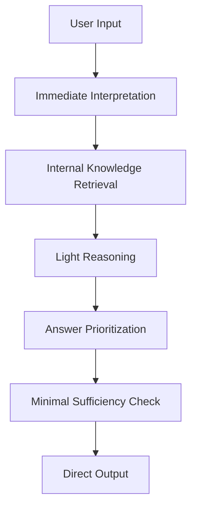
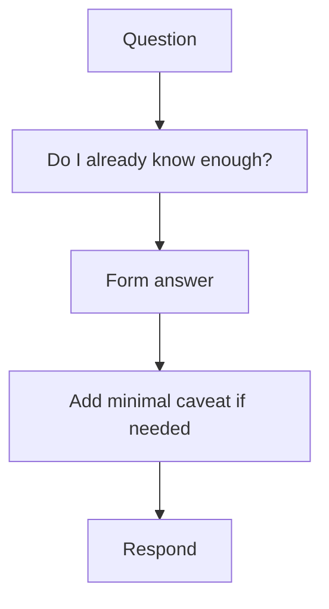

# Direct Answer Mode

Direct Answer Mode は、ユーザーの依頼に対して、**外部検索や重い多段処理を挟まず、内部知識と軽量な推論によって直接答える運転モード**である。  
このモードの本質は、単なる即答ではなく、**不要な探索を省きつつ、十分な正確性と明快さで最短距離の応答を返すこと**にある。

---

# 要点

- 安定知識や低変動知識に対して使う
- 目的は速度と簡潔性の両立である
- 外部情報取得を行わないぶん、適用範囲の見極めが重要になる
- 深い調査より、問いに対する直接的な解答を優先する
- ただし、単純化しすぎて根拠や注意点を落としてはいけない

---

# なぜ必要か

すべての質問に検索や長い推論を挟むと、応答は重く遅くなる。  
一方で、多くの問いは、

- 定義説明
- 概念整理
- 基礎的比較
- 一般原理の解説
- 既知内容の構造化

のように、内部知識と短い推論で十分答えられる。

このような場面で Direct Answer Mode を使うことで、

- 速度が出る
- 応答が簡潔になる
- ユーザーの認知負荷が下がる
- 不要なツール依存を避けられる

したがってこれは、**LLM の基本応答能力を最も効率よく使う標準モード**である。

---

# 適用場面

## 1. 安定知識の説明
例:
- 概念の意味
- 基本原理
- 一般的な違い
- 古典的知識

## 2. 軽い論理整理
例:
- この考え方は妥当か
- どう整理すべきか
- 構造上どう位置づけるか

## 3. ユーザー文脈に基づく継続作業
例:
- 続きを作る
- 直前のフォーマットを踏襲する
- ノート構造の延長を書く

## 4. 形式変換・再表現
例:
- 言い換え
- 要約
- 箇条書き化
- コードブロック化

---

# 適用してはいけない場面

Direct Answer Mode が不適切なのは、主に次のような場合である。

- 最新性が必要
- 現在の制度や価格が関わる
- ニッチで不確かな固有情報が必要
- ファイル本文が根拠となる
- 外部状態の読み取りが必要
- 厳密な引用が必要
- 実行操作が必要

この場合は、Search-Augmented Mode や File-Grounded Mode などへ切り替えるべきである。

---

# 中核機能

## 1. Immediate Interpretation
入力を素早く解釈し、主質問を短く明確に捉える。

ここでは、
- 何を聞かれているか
- どの範囲で答えるか
- どの深さで足りるか

を即時に見極める。

---

## 2. Internal Knowledge Retrieval
内部知識から、関連概念・原理・既知パターンを取り出す。

重要なのは、網羅性よりも**質問に直接関係する知識を優先すること**である。

---

## 3. Light Reasoning
必要最小限の推論で、知識を問いに適合させる。

内容:
- 定義の適用
- 分類
- 軽い比較
- 論理接続
- 簡潔な因果整理

このモードでは、複雑な探索木ではなく、**短い推論経路**を使う。

---

## 4. Answer Prioritization
まず何を答えるべきかを決める。

原則:
- 結論先出し
- 余計な前置きを減らす
- 主質問に直接答える
- 補足は必要分だけ添える

---

## 5. Minimal Sufficiency Check
簡潔であっても、最低限の十分性を満たしているか確認する。

確認項目:
- 問いに答えているか
- 誤解を招かないか
- 必要な限定や但し書きがあるか
- 構造がわかりやすいか

---

# 処理の特徴

## 速度優先
深掘り前にまず答える。

## 構造優先
長い説明より、明快な整理を重視する。

## 低コスト
ツールや検索を使わずに済む。

## 限定的確信
不確かな場合は断定を避ける必要がある。

---

# 下位構造

## A. Fast Intent Reader
依頼の中心を素早く読む部分。

## B. Internal Retriever
内部知識から必要項目を取り出す部分。

## C. Light Reasoner
短い推論で答えを組み立てる部分。

## D. Direct Composer
結論先出しで応答文を組み立てる部分。

## E. Sufficiency Checker
短くても必要条件を満たしているか確認する部分。

---

# 全体構造

---

# 典型フロー

---

# 典型例

|入力|Direct Answer Mode の応答傾向|
|---|---|
|概念の違いを教えて|定義と差分を簡潔に出す|
|この構造は何ですか|位置づけと役割を説明する|
|どう整理するのがよいですか|基本方針を即答する|
|続けてください|直前形式を踏襲して続行する|
|この文章を短くして|直接圧縮して返す|

---

# よくある失敗

## 1. 検索すべき内容まで直答する

最新性や外部根拠が必要なのに内部知識で済ませてしまう。

## 2. 速さを優先しすぎて粗くなる

問いには答えるが、重要な条件や限定を落とす。

## 3. 前置きが長い

Direct なのに直接答えず、背景説明から入ってしまう。

## 4. 深掘り不足

比較や構造整理が必要なのに、定義だけで終わる。

## 5. 自信過剰

不確かな内容を断定口調で出してしまう。

---

# 設計原則

- まず問いに答える    
- 安定知識に限定して使う    
- 必要最小限の推論で組み立てる    
- 結論を先に置く    
- 補足は必要分だけ付ける    
- 不確実なら軽く限定する    
- 検索が必要ならすぐ別モードへ切り替える    

---

# 位置づけ

Direct Answer Mode は、  
**LLM の内部知識と軽量推論を最短距離で出力へ変える基本応答モード**である。

これが強いと、

- 速く    
- 明快で    
- 過不足の少ない    

応答ができる。  
一方でこれを過信すると、最新性や根拠性を誤る。  
したがってこのモードは、**最も基本だが、適用範囲の見極めが重要な標準運転形態**である。

---

# 関連ノート

- [[Mode Selection]]    
- [[Search-Augmented Mode]]    
- [[File-Grounded Mode]]    
- [[Task Routing]]    
- [[Termination Control]]    
- [[LLM Output Layer]] 
- [[LLM Output Layer]]]] 
- [[LLM Output Layer]]]] 
- [[LLM Output Layer]]]] 
- [[LLM Output Layer]]]]