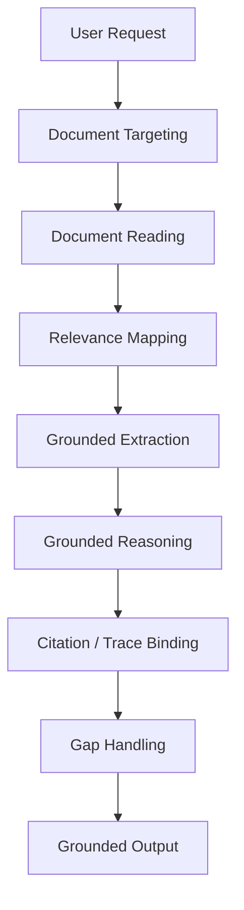
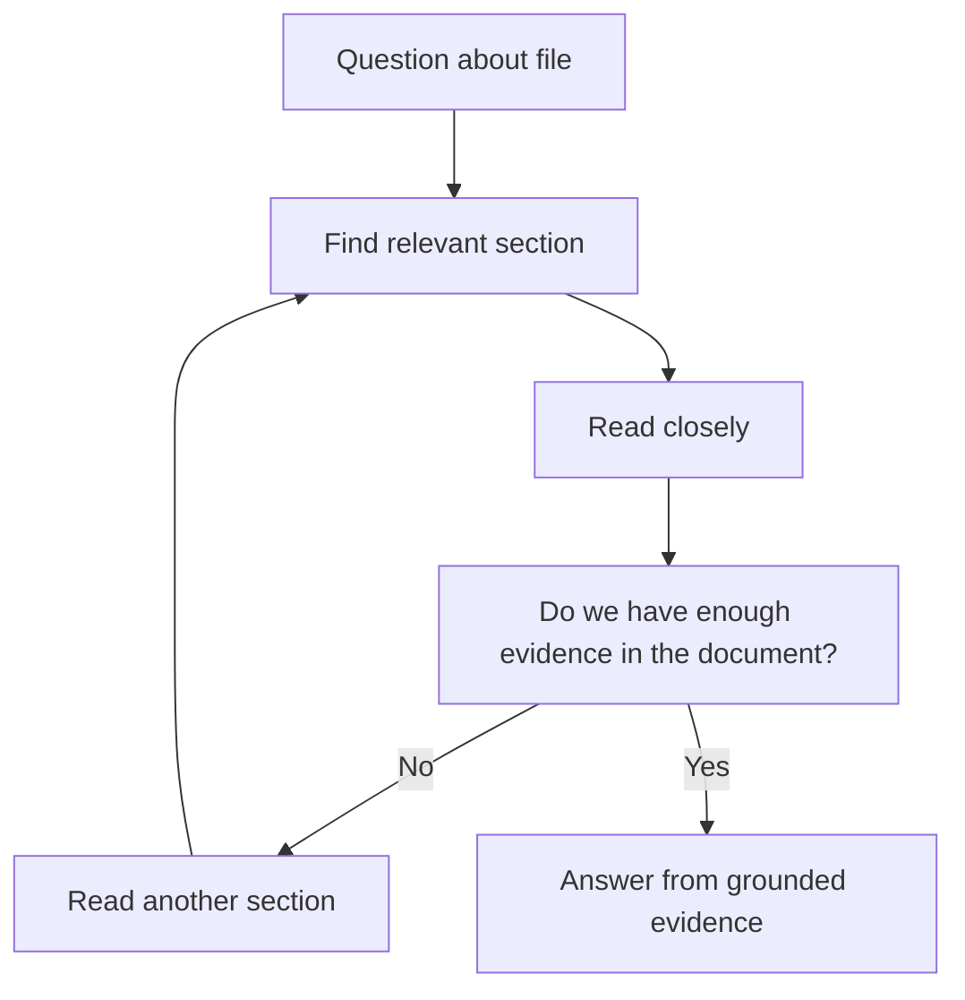

  
# File-Grounded Mode  
  
File-Grounded Mode は、ユーザーが与えたファイルや接続ソース上の文書を**主要な根拠源として読み取り、その内容に基づいて回答・要約・分析・生成を行う運転モード**である。  
このモードの本質は、一般知識で埋めることではなく、**特定文書に根拠を固定し、その範囲内で忠実かつ有用に処理すること**にある。  
  
---  
  
# 要点  
  
- 主根拠は外部公開知識ではなく、与えられた文書や資料である  
- 回答は「その文書に何が書いてあるか」に強く拘束される  
- 要約・比較・抽出・変換・引用対応が中心になる  
- 必要に応じて一般知識は補助的に使うが、文書根拠を上書きしてはいけない  
- 文書未確認部分を推測で埋めすぎないことが重要である  
  
---  
  
# なぜ必要か  
  
多くの実務依頼では、一般知識よりも特定資料の内容が重要になる。  
たとえば、  
  
- アップロードされたPDFの要約  
- Google Drive上のドキュメントの確認  
- 仕様書の比較  
- 議事録の抽出  
- 提案書や契約書のレビュー  
- スライドやシートの読み取り  
  
こうした場面では、一般的に正しいことを述べるだけでは足りない。  
必要なのは、**その文書に何があり、何がなく、どこに根拠があるか**を把握することである。  
  
そのため File-Grounded Mode は、**文書基盤の読解と応答を安定させる専用モード**として必要になる。  
  
---  
  
# 適用場面  
  
## 1. 文書内容の要約  
例:  
- このPDFを要約して  
- この資料の要点をまとめて  
  
## 2. 文書内容の抽出  
例:  
- この契約書の期限条項を抜いて  
- 重要な数値を拾って  
  
## 3. 文書間比較  
例:  
- この2つの提案書の違いを比較して  
- バージョン差分を見て  
  
## 4. 文書に基づく生成  
例:  
- この資料をもとにメールを書いて  
- この議事録からアクション項目を作って  
  
## 5. 根拠限定の質問応答  
例:  
- このファイルにそう書いてありますか  
- この資料の範囲で答えて  
  
---  
  
# 適用してはいけない場面  
  
- 添付資料がない一般質問  
- 最新ニュースの確認  
- 公開Web情報が主対象の調査  
- 純粋な創作や相談  
- 文書と無関係な一般概念説明  
  
この場合は Direct Answer Mode や Search-Augmented Mode の方が適切である。  
  
---  
  
# 中核機能  
  
## 1. Document Targeting  
どのファイル・どの資料・どの範囲を根拠にするかを特定する。  
  
対象:  
- アップロードファイル  
- 接続ドキュメント  
- スライド  
- スプレッドシート  
- PDF  
- スレッドや記録文書  
  
ここで根拠対象を誤ると、全体がずれる。  
  
---  
  
## 2. Document Reading  
対象文書を読み取り、必要部分へアクセスする。  
  
読む対象:  
- 本文  
- 見出し  
- 表  
- 数値  
- 箇条書き  
- ページ構造  
- 画像や図表の周辺文脈  
  
このモードでは、単なる全文走査ではなく、**問いに必要な読解単位**が重要である。  
  
---  
  
## 3. Relevance Mapping  
文書内のどの部分が質問に関係するかを特定する。  
  
見る観点:  
- キーワード一致  
- 意味的近接  
- セクション構造  
- 役割上の重要箇所  
- 数値や固有名詞の出現  
- 依頼された範囲指定  
  
---  
  
## 4. Grounded Extraction  
関係箇所から、必要な主張・数値・論点・アクションを抽出する。  
  
重要なのは、  
- 文書にあること  
- 文書にないこと  
- 文書から推定できること  
  
を分けることである。  
  
---  
  
## 5. Grounded Reasoning  
抽出した文書内容に基づいて、必要な整理・比較・要約・変換を行う。  
  
ここでの推論は、**文書拘束下の推論**である。  
つまり自由な一般知識推論ではなく、資料に書かれた内容を壊さない範囲で行う。  
  
---  
  
## 6. Citation or Trace Binding  
回答のどの部分が文書のどこに基づいているかを対応づける。  
  
用途:  
- 検証可能性の確保  
- ユーザーによる追跡  
- 解釈過剰の防止  
- 比較結果の根拠明示  
  
---  
  
## 7. Gap Handling  
文書に書かれていない場合、その不在を適切に扱う。  
  
対応:  
- 書かれていないと明示する  
- 資料からは確認できないと述べる  
- 必要に応じて補助検索へ切り替える  
- 推定で埋めすぎない  
  
---  
  
# 文書根拠モードの基本姿勢  
  
## 文書優先  
まず資料に忠実であること。  
  
## 推測抑制  
書かれていないことを安易に補わないこと。  
  
## 範囲明示  
どの資料・どの範囲に基づくかを意識すること。  
  
## 構造読解  
単語一致だけでなく、見出しや文脈も読むこと。  
  
---  
  
# 下位構造  
  
## A. File Locator  
対象ファイルを特定する部分。  
  
## B. Section Reader  
必要箇所を読む部分。  
  
## C. Relevance Mapper  
質問と文書箇所を対応づける部分。  
  
## D. Grounded Extractor  
文書中の事実や論点を抽出する部分。  
  
## E. Trace Binder  
回答と根拠位置を結びつける部分。  
  
## F. Gap Manager  
文書不足や未記載を扱う部分。  
  
---  
  
# 全体構造  
  

---

# 文書読解ループ

---

# 典型例

|入力|File-Grounded Mode の動き|
|---|---|
|このPDFを要約して|PDFを読み主要論点を抽出する|
|この契約書の更新条項は|該当条項を特定して抜き出す|
|この2つの資料を比べて|両方の関係箇所を比較する|
|この議事録からToDoを出して|アクション記述を抽出して整理する|
|この資料にその主張はあるか|根拠箇所の有無を確認する|

---

# よくある失敗

## 1. 一般知識で埋める

文書にない内容を、もっともらしく補ってしまう。

## 2. 根拠対象を誤る

別ファイルや別セクションの内容を混ぜてしまう。

## 3. 文書全体を平板に扱う

見出し構造や重要箇所の重みづけがない。

## 4. 不在情報を誤読する

書いていないことを、あるいはその逆に解釈する。

## 5. 根拠対応が弱い

どの結論がどの箇所から来たのか追えない。

---

# 設計原則

- 文書を主根拠として扱う
    
- 対象資料を最初に明確にする
    
- 質問に関係する箇所を重点読解する
    
- 事実・推定・不在を分ける
    
- 資料に忠実な推論を行う
    
- 根拠位置を追跡可能にする
    
- 不足時は不足として明示する
    

---

# 位置づけ

File-Grounded Mode は、  
**特定文書に根拠を固定し、その範囲内で読解・整理・応答を行う文書拘束型モード**である。

これが強いと、

- 資料ベースの精度が上がり
    
- 引用可能性が増し
    
- 実務文書への対応力が高まる
    

一方で、文書拘束を忘れると一般論に逃げやすい。  
したがってこのモードは、**文書の中に答えを探し、文書の外へ出す時は明示的に出るための読解統制モード**である。

---

# 関連ノート

- [[02_zettelkasten/00_system/Mode Selection]]    
- [[02_zettelkasten/00_system/Direct Answer Mode]]    
- [[Search-Augmented Mode]]    
- [[Tool Orchestration]]    
- [[02_zettelkasten/00_system/Constraint Monitor]]    
- [[LLM Output Layer]] 
- [[LLM Output Layer]]]]   
- [[LLM Output Layer]]