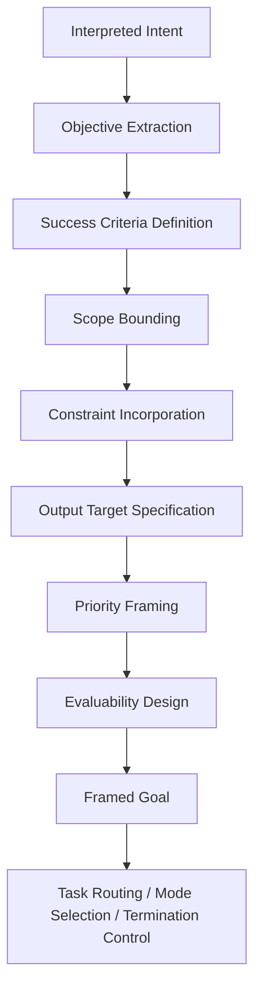
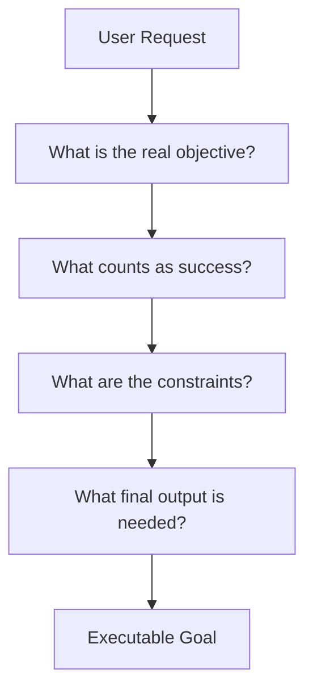

  
# Goal Framing  
  
Goal Framing は、解釈された意図を、**実行可能で評価可能な処理目標へ定式化する構造**である。  
これは「何を言われたか」を「何を達成すべきか」へ変換する工程であり、LLM の処理全体に方向性・終了条件・評価基準を与える。  
  
---  
  
# 要点  
  
- ユーザーの依頼は、そのままでは処理目標として曖昧なことが多い  
- Goal Framing は、発話を達成目標・成功条件・制約条件へ変換する  
- タスク分類は「何の仕事か」を決めるが、Goal Framing は「その仕事で何を成功とみなすか」を決める  
- 良いフレーミングは、深掘りしすぎや浅すぎを防ぐ  
- 目標が明確になると、ツール選択・停止判断・出力形式も安定する  
  
---  
  
# なぜ必要か  
  
たとえば「これについて教えてください」という依頼は、そのままでは曖昧である。  
本当に必要なのは、  
  
- 概要説明なのか  
- 比較付き説明なのか  
- 初学者向け整理なのか  
- 実務で使うための整理なのか  
- 判断材料の提示なのか  
  
を明確にすることである。  
  
また「作ってください」という依頼も、  
- 叩き台が欲しいのか  
- 完成版が欲しいのか  
- 貼り付け可能な形が欲しいのか  
- 理由説明込みが欲しいのか  
  
で達成条件が違う。  
  
Goal Framing は、このような曖昧さを、**処理可能な目標形式へ落とし込む中枢**である。  
  
---  
  
# 中核機能  
  
## 1. Objective Extraction  
発話や文脈から、主たる達成目標を抽出する。  
  
例:  
- 情報理解  
- 妥当性評価  
- 比較判断  
- 成果物生成  
- 実行支援  
- 誤り修正  
- 構造整理  
  
この段階では、依頼の中心目的を一つまたは少数に絞る。  
  
---  
  
## 2. Success Criteria Definition  
何をもって成功とみなすかを定義する。  
  
例:  
- 説明タスク  
→ 概念が正確でわかりやすいこと  
  
- 比較タスク  
→ 比較軸・差分・推奨が明示されていること  
  
- ノート生成  
→ 指定形式でそのまま貼れること  
  
- 調査タスク  
→ 十分な根拠と引用があること  
  
これにより、Termination Control が働きやすくなる。  
  
---  
  
## 3. Scope Bounding  
目標の対象範囲を定める。  
  
境界対象:  
- 扱う論点の幅  
- 時間範囲  
- 深さ  
- 対象読者  
- 出力長  
- 根拠範囲  
- 作業単位  
  
これを怠ると、関係のない補足が肥大化しやすい。  
  
---  
  
## 4. Constraint Incorporation  
達成目標の中に制約を組み込む。  
  
例:  
- コードブロックで出す  
- Mermaid を閉じ忘れない  
- Web確認が必要  
- 引用必須  
- 余計な説明を省く  
- 日本語で出す  
- 直前の形式を踏襲する  
  
Goal Framing は、目標と制約を別物としてではなく、**制約込みの目標**として扱う。  
  
---  
  
## 5. Output Target Specification  
最終的にどのような成果物を作るのかを定める。  
  
例:  
- 回答文  
- 比較表  
- ノート本文  
- JSON  
- コード  
- スケジュール案  
- メール草案  
- 分析レポート  
  
これは出力形式の指定であると同時に、処理中の判断基準でもある。  
  
---  
  
## 6. Priority Framing  
主目標と副目標の優先順位を決める。  
  
例:  
- 主目標: ノート本文完成  
- 副目標: 理由説明  
- 副目標: 関連ノート列挙  
  
優先順位が明確であれば、限られた長さや時間でも主目的を守れる。  
  
---  
  
## 7. Evaluability Design  
目標が、後で達成判定できる形になっているかを確認する。  
  
良い目標は、  
- 完了したか判定できる  
- 不足部分がわかる  
- 停止条件が置ける  
- 出力品質を評価できる  
  
という性質を持つ。  
  
---  
  
# 目標フレームの基本構成  
  
Goal Framing は、しばしば次の要素で構成される。  
  
- 何を達成するか  
- 何を含めるか  
- 何を含めないか  
- 何形式で出すか  
- どの深さで出すか  
- 何を成功とみなすか  
- どの制約を守るか  
  
---  
  
# 下位構造  
  
## A. Objective Builder  
主目的を抽出・定式化する部分。  
  
## B. Success Criterion Setter  
成功条件を置く部分。  
  
## C. Scope Definer  
対象範囲と深さを決める部分。  
  
## D. Constraint Integrator  
制約を目標定義へ組み込む部分。  
  
## E. Output Targeter  
最終成果物像を定義する部分。  
  
## F. Priority Setter  
主目標と副目標の優先順位を決める部分。  
  
---  
  
# 全体構造  
  

---

# 目標定式化の流れ

---

# 典型例

|入力|Goal Framing の結果|
|---|---|
|これを説明してください|正確で理解しやすい説明を作る|
|比較してください|比較軸・差分・結論を示す|
|ノートを作ってください|貼り付け可能なノート本文を完成させる|
|続けてください|直前フォーマットのまま未完部分を継続完成させる|
|最新情報を教えてください|外部確認済みの最新情報を根拠付きで要約する|
|この形式で出してください|指定形式準拠を成功条件に含める|

---

# よくある失敗

## 1. 目標が発話の言い換えで終わる

実行可能な成功条件まで落ちていない。

## 2. 範囲が広すぎる

何でも含めようとして焦点がぼける。

## 3. 制約を後付けにする

最後に形式だけ合わせようとして中身がずれる。

## 4. 副目標が主目標を圧迫する

補足説明が本体より長くなる。

## 5. 達成判定できない

どこで終えてよいかわからなくなる。

---

# 設計原則

- 発話を達成目標に翻訳する
    
- 成功条件を必ず置く
    
- 範囲を先に切る
    
- 制約を目標定義に組み込む
    
- 成果物像を明確にする
    
- 主目標と副目標を分ける
    
- 停止判定できる形にする
    

---

# 位置づけ

Goal Framing は、  
**解釈された意図に、実行可能性と評価可能性を与える目標定式化構造**である。

これが弱いと、

- 何となく進み
    
- 過不足のある応答になり
    
- どこで止めるべきかも曖昧になり
    
- 成果物の完成条件もぶれる
    

したがってこの構造は、単なる目的理解ではなく、  
**LLM の処理全体に進行方向と完了条件を与える目標設計機構**である。

---

# 関連ノート

- [[Intent Interpretation]]    
- [[Task Routing]]    
- [[02_zettelkasten/00_system/Mode Selection]]    
- [[Termination Control]]    
- [[Constraint Monitor]]    
- [[LLM Control Layer]]  
- [[LLM Control Layer]]
- [[LLM Control Layer]]]]
- [[LLM Control Layer]]]]